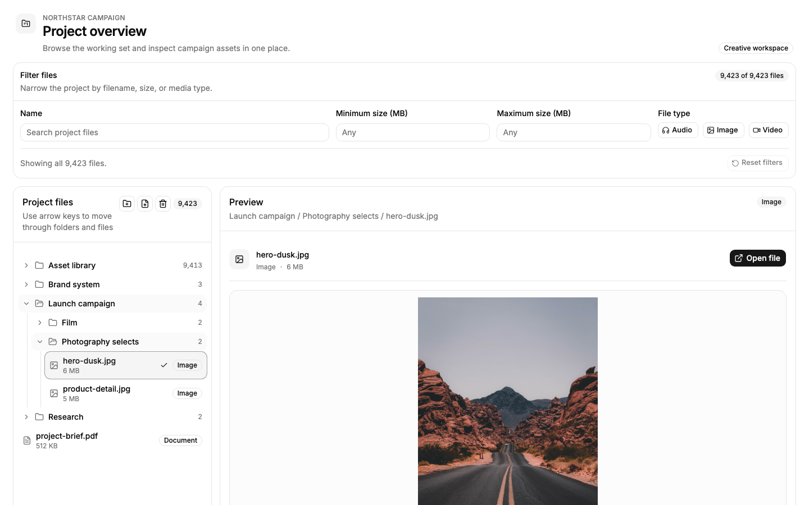
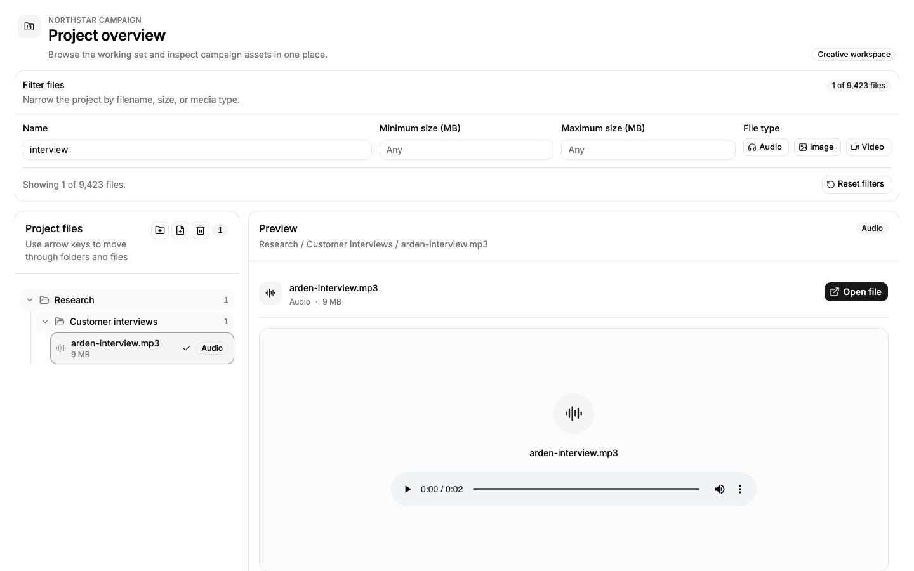
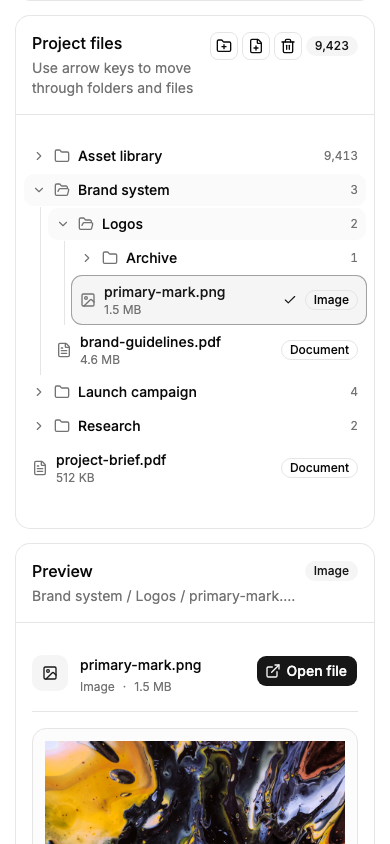
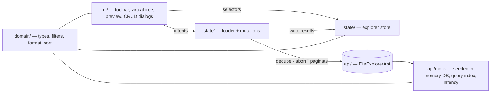
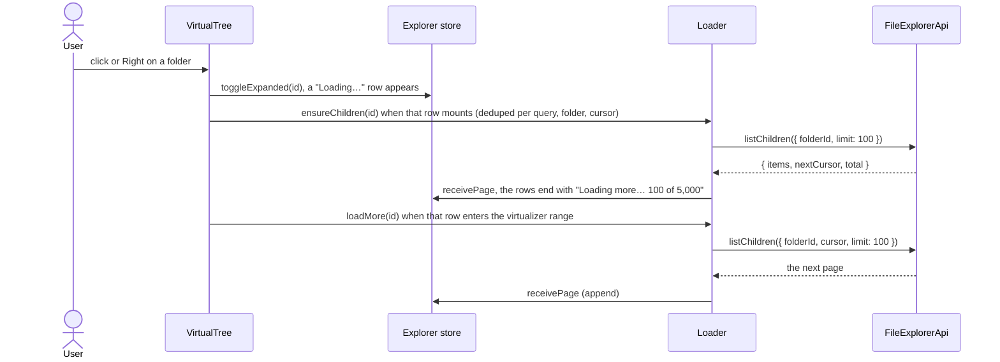
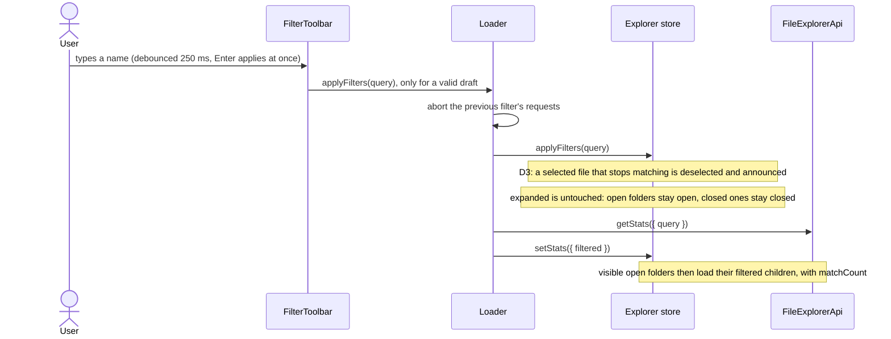
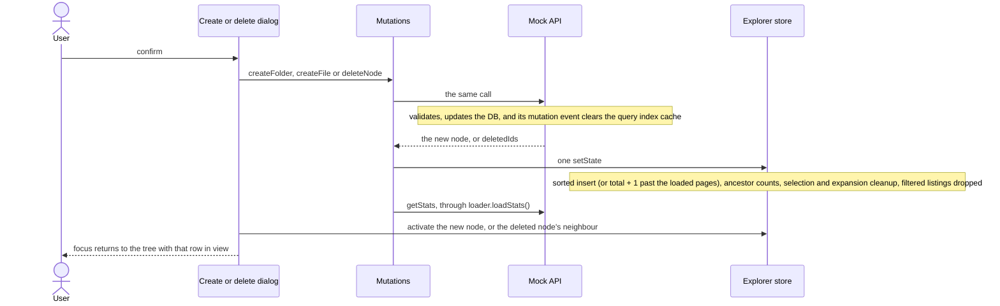

# File Explorer at scale — Bindecy take-home

A client-side React file explorer that browses, filters, previews and edits a 10k–100k-node tree through a mocked, backend-like API, requesting only what the current view shows.

[](https://github.com/itays/bindecy-interview/actions/workflows/ci.yml) · **Live demo: [file-explorer-task.pages.dev](https://file-explorer-task.pages.dev)**

## Try it in 2 minutes

| Preset | What it shows |
| --- | --- |
| [Default](https://file-explorer-task.pages.dev/) | 10,000 nodes, 250 ms latency per request (±50% jitter) |
| [`?nodes=100000&latency=0`](https://file-explorer-task.pages.dev/?nodes=100000&latency=0) | Scale: 100,000 nodes with instant responses |
| [`?latency=1500`](https://file-explorer-task.pages.dev/?latency=1500) | The "Loading…" and "Loading more… N of M" rows, and the preview's loading state |
| [`?failFirst=1`](https://file-explorer-task.pages.dev/?failFirst=1) | The first listing fails: the error row and Retry |

1. Expand **Asset library**, scroll down to **Stock footage** (5,000 files), open it and keep scrolling: pages of 100 load as you reach the end.
2. Open **Brand system**, then type `wordmark` in the name filter: the counts update, Brand system stays open and the other folders stay as they were. Filters never open or close folders; the match counts lead down to Logos › Archive.
3. Select a file: the preview renders the image, audio, video or PDF.
4. Click **New folder** in the tree header: it goes into the active folder (or the active file's folder) in sorted position, active and in view.
5. Press <kbd>Delete</kbd> (or the trash button) and confirm: the row goes and focus moves to its neighbour.

## Screenshots

| Desktop: nested folders, an image previewed | Active name filter: folders keep their open state, counts follow | Mobile (390 px): one stacked column |
| --- | --- | --- |
|  |  |  |

## Requirements coverage

| Brief item | How it's met | Main file (in `app/features/file-explorer/`) |
| --- | --- | --- |
| 1. Recursive folder tree | One flat, virtualized `role="tree"` built from per-folder listings, any depth (the generated Deep archive is 22 levels), per-folder expand and collapse | [`state/visible-rows.ts`](app/features/file-explorer/state/visible-rows.ts) |
| 2. Categorized file display | Category icon, badge and size on every file row; folders show their file count | [`ui/tree/tree-row.tsx`](app/features/file-explorer/ui/tree/tree-row.tsx) |
| 3. File preview panel | Selecting a file fetches its detail (path, `previewUrl`); image, audio, video and PDF renderers with loading, error and "Open file" fallbacks | [`ui/preview/file-preview.tsx`](app/features/file-explorer/ui/preview/file-preview.tsx) |
| 4. CRUD | New folder, New file and Delete dialogs; the API rejects duplicate names, and the store patches listings and counts in place | [`state/mutations.ts`](app/features/file-explorer/state/mutations.ts) |
| 5. Multi-field filters | Name, size range (MB) and category toggles, validated and debounced; the server returns only matching branches, with match counts | [`ui/filter-toolbar/filter-toolbar.tsx`](app/features/file-explorer/ui/filter-toolbar/filter-toolbar.tsx) |
| 6. Performance at scale | See [Scaling to 10k+](#scaling-to-10k) | [`ui/tree/virtual-tree.tsx`](app/features/file-explorer/ui/tree/virtual-tree.tsx) |
| Addendum: large tree, never loaded whole | Only the top level loads on mount; a folder's children load when it's expanded | [`state/loader.ts`](app/features/file-explorer/state/loader.ts) |
| Addendum: backend-like mocked API | `FileExplorerApi` (children, node, search, stats, create, delete) with keyset cursors, latency, aborts and injected failures, over a seeded in-memory DB | [`api/file-explorer-api.ts`](app/features/file-explorer/api/file-explorer-api.ts) |
| Addendum: request only what the view needs | A page loads when its row scrolls into range, the preview fetches one node, a filter asks only for its count and the listings of folders on screen | [`state/loader.ts`](app/features/file-explorer/state/loader.ts) |
| Addendum: architecture, state, rendering, scaling | Layered feature folder, one store per provider, fixed-height virtual rows (see below) | [`state/explorer-store.ts`](app/features/file-explorer/state/explorer-store.ts) |

## Architecture



```text
app/features/file-explorer/
  domain/   types, filter rules, size formatting, sort order (no React, no I/O)
  api/      the FileExplorerApi contract and ApiError
    mock/   seeded generator, in-memory DB, query index, mutations, latency adapter
  state/    Zustand store, visible-row flattening, loader, mutations, provider and hooks
  ui/       page shell, filter toolbar, virtual tree, preview, CRUD dialogs
```

Imports only go `ui → state → api`; every layer may use `domain`, and `api/mock` never imports `state` or `ui`.

## Main flows

<details>
<summary>Expanding a folder and paging</summary>



</details>

<details>
<summary>Applying a filter</summary>



</details>

<details>
<summary>Create and delete</summary>



</details>

## State and data contract

- **One vanilla Zustand store per `ExplorerProvider`** holds normalized `nodesById`, `listings[queryKey][folderId]` (ids, cursor, total, status), one `expanded` set shared by browsing and every filter, selection, the active row and counts. Actions are synchronous, so D3 and each CRUD update land in one `set`.
- **A hand-written loader owns the I/O:** it dedupes in-flight pages, gives each filter its own abort controller, retries, and drops responses whose query or folder is gone.
- **Why not TanStack Query (D1):** the flat row list needs synchronous reads of every loaded listing, `useQueries` has no infinite queries, and CRUD edits counts and listings across many cached pages.

<details>
<summary>The <code>FileExplorerApi</code> interface</summary>

```ts
interface FileExplorerApi {
  listChildren(request: { folderId: string | null; query?: FileQuery; cursor?: string; limit: number }, signal?: AbortSignal): Promise<Page<NodeSummary>>
  getNode(id: string, signal?: AbortSignal): Promise<NodeDetail> // ancestors + previewUrl
  search(request: { query: FileQuery; cursor?: string; limit: number }, signal?: AbortSignal): Promise<Page<SearchHit>> // tree order
  getStats(request: { query?: FileQuery }, signal?: AbortSignal): Promise<{ fileCount: number }>
  createFolder(input: { parentId: string | null; name: string }): Promise<NodeSummary>
  createFile(input: { parentId: string | null; name: string; category: FileCategory; sizeInBytes: number; previewUrl: string }): Promise<NodeSummary>
  deleteNode(id: string): Promise<{ deletedIds: string[] }>
}
type Page<T> = { items: T[]; nextCursor: string | null; total: number }
```

Cursors are opaque keysets over (folders first, lowercased name, id), so creates and deletes between pages never skip or repeat a node. An abort rejects with `AbortError`; other failures reject with `ApiError` (`network`, `not-found`, `conflict`, `validation`). Full JSDoc: [`api/file-explorer-api.ts`](app/features/file-explorer/api/file-explorer-api.ts).

</details>

## Scaling to 10k+

- **Lazy listings:** only expanded folders are fetched, so a collapsed subtree costs nothing.
- **Keyset paging:** 100 children per page, requested when the load-more row enters the virtualizer range, so a 5,000-child folder never arrives in one response.
- **Virtualization with fixed row heights:** only the visible rows (plus 10 overscan) are in the DOM, and exact per-kind heights mean nothing is measured.
- **Per-row store subscriptions:** each memoized row selects its own expanded, selected and active flags, so a selection or focus change re-renders one or two rows.
- **Debounced filters with aborted stale requests:** typing sends one query per pause, and a superseded query's requests are cancelled and ignored.
- **Server-side query index:** one cached O(n) scan per query computes the matches and per-folder match counts, so the client never walks the whole tree.

Evidence: [`e2e/tree.e2e.ts`](e2e/tree.e2e.ts) scrolls to row 1,000 of the 5,000-child folder and asserts at most 100 `treeitem`s in the DOM, and the [`?nodes=100000&latency=0`](https://file-explorer-task.pages.dev/?nodes=100000&latency=0) preset runs the same UI on 100k nodes.

Next steps: a real search index, ETags and conditional requests, push invalidation over websockets, a Web Worker for the mock (D4), and TanStack Pacer's async queuer for bulk operations.

## Where to look first

- [`api/file-explorer-api.ts`](app/features/file-explorer/api/file-explorer-api.ts): the data contract (paging, cursors, errors).
- [`state/explorer-store.ts`](app/features/file-explorer/state/explorer-store.ts): the state shape, listings per query, and applying filters with D3.
- [`state/loader.ts`](app/features/file-explorer/state/loader.ts): dedupe, abort, paging and retry.
- [`api/mock/mock-query-index.ts`](app/features/file-explorer/api/mock/mock-query-index.ts): the backend side of filtering (one scan, match counts, LRU).
- [`ui/tree/virtual-tree.tsx`](app/features/file-explorer/ui/tree/virtual-tree.tsx): the virtualizer, `aria-activedescendant` focus and keyboard dispatch.

## Tech stack

| Area | Choice |
| --- | --- |
| App | React 19, React Router 7 in SPA mode (`ssr: false`), TypeScript |
| UI | Tailwind CSS v4, shadcn/ui on Base UI, Lucide icons |
| State and rendering | Zustand 5, `@tanstack/react-virtual` 3, `use-debounce` |
| Tests | Vitest and Testing Library (jsdom), Playwright (Chromium) |
| Tooling | Bun 1.4, Vite 8, Prettier, GitHub Actions, Cloudflare Pages |

## Running locally

Prerequisite: [Bun](https://bun.com) 1.4, since the repo has only `bun.lock`: `curl -fsSL https://bun.com/install | bash -s "bun-v1.4.0"`.

```bash
bun install
bun run dev                        # http://localhost:5173
bun run test
bunx playwright install chromium   # once, before the first E2E run
bun run test:e2e
```

| Command | What it does |
| --- | --- |
| `bun run dev` | Development server |
| `bun run build` / `bun run start` | SPA build to `build/client` / serve it with `vite preview` |
| `bun run test` / `bun run test:watch` | Unit and component tests (Vitest) |
| `bun run test:e2e` | Build, serve and run the Playwright suite (port `E2E_PORT`, default 4173) |
| `bun run test:e2e:smoke` / `test:e2e:headed` / `test:e2e:ui` | The `@smoke` spec only (CI) / in a visible browser / UI mode |
| `bun run typecheck` / `bun run format:check` / `bun run format` | Route types and `tsc` / Prettier check / Prettier write |

Mock backend URL params (a missing or non-numeric value uses the default; out-of-range values are clamped):

| Param | Default | Range | Effect |
| --- | --- | --- | --- |
| `seed` | 1 | any integer | Seeds the tree, latency jitter and random failures |
| `nodes` | 10000 | 18–200,000 | Total nodes, curated fixture included |
| `latency` | 250 | 0–10,000 ms | Base delay per call, ±50% jitter; 0 resolves on a microtask |
| `failRate` | 0 | 0–1 | Chance that a read rejects with a network error |
| `failFirst` | 0 | 0–1,000 | The first N `listChildren` calls fail, then they succeed |

## Tradeoffs and limitations

- The data lives in memory: creates and deletes reset on reload.
- The mock runs on the main thread (D4). At 100k nodes, building it takes about 120 ms on load and a new filter's first scan about 16 ms.
- Previews load external URLs (w3.org, Unsplash, MDN), so they need the network; the E2E specs stub them.
- E2E runs in Chromium only; CI runs the smoke spec, and the full suite runs locally.
- Filters never open folders: a match inside a closed folder is reached by following the match counts.

## Process

The brief and the interviewer's addendum are in [`docs/bindecy-task.md`](docs/bindecy-task.md), the plan and decision log (D1–D12) in [`docs/plan.md`](docs/plan.md), and the task breakdown with each task's outcome in [`docs/tasks.md`](docs/tasks.md).
