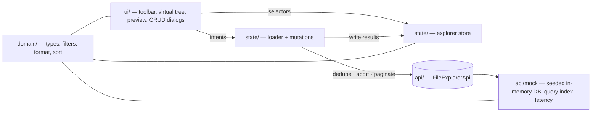

# Plan: Scalable File Explorer (lazy-loaded, virtualized)

> Source: `bindecy-task.md` plus the interviewer's clarification that the main evaluation areas are **performance** and **code structure**.
> Target: the existing React Router 7 + React 19 + TypeScript + Tailwind CSS v4 + shadcn/ui (Base UI) app.
> Task breakdown: [`tasks.md`](./tasks.md) · Visual summary: [`show-me-refactor-plan.html`](./show-me-refactor-plan.html)

## Goal

Refactor the working single-page explorer (filters, recursive tree, preview) so it scales to a tree with tens of thousands of items. The frontend requests only the data needed for the current view, through a realistic data-access interface backed by a mocked in-memory backend. Also add the two scope items the first iteration missed: **CRUD** (task scope #4) and a written **scaling strategy** (scope #6).

## Evaluation criteria (from the interviewer)

- Design for a large tree (many thousands of items); don't assume the whole tree is loaded at once.
- Define a data-access interface (children of a folder, search, filtering, pagination) and implement it against mocked data that behaves like a backend.
- Show deliberate performance choices: lazy folder loading, list virtualization, pagination, memoization, efficient tree updates.
- Separate the UI, state, domain logic and data-access layers clearly.
- Choose and explain a state-management approach covering expanded folders, selection, filters, loading states and cached folder contents.

## Current state and why it doesn't scale

| Where | What happens | Cost at 10k+ nodes |
| --- | --- | --- |
| `project-overview.tsx:40` `filterProjectTree(projectFiles, filters)` | Clones and filters the whole tree on every keystroke, with no debounce | O(n) per keystroke |
| `project-overview.tsx:26`, `file-tree.tsx:79` `countFiles` | Walks the whole tree on every render | O(n) per render |
| `tree-node.tsx:256` `countFiles(node.children)` | Runs per folder row | O(n·depth) per render |
| `tree-node.tsx:342` recursive `<ul>` | Every expanded node stays mounted | O(visible) DOM nodes |
| `activeNodeId` / `selectedFileId` / `expandedFolderIds` passed to every node | No memo; one keypress re-renders the whole tree | O(visible) per keypress |
| `tree-node.tsx:41` `querySelectorAll('[role="treeitem"]')` | Keyboard navigation reads the DOM | Breaks under virtualization |
| `findFileLocation` / `visibleFileIds` | Need the whole tree in memory | Impossible with lazy loading |
| `react-router.config.ts` `ssr: true` | The brief requires pure client-side React | Brief mismatch |

## Decision log

| # | Decision | Rationale |
| --- | --- | --- |
| D1 | **Tree data lives in one normalized Zustand store plus a hand-written loader.** No TanStack Query. | The flat row list needs synchronous access to every loaded listing, and `useQueries` has no infinite-query support. CRUD changes counts and listings across many cached responses. Page-boundary inserts are awkward in `pages[]`. The loader (dedupe, abort, pagination) is about 100 tested lines. |
| D2 | **Filtering keeps the tree, loaded lazily.** The server returns only matching or match-containing children with a `matchCount`. The client auto-expands the ancestor paths of the first ~50 hits. | Keeps the brief's target layout and scales. |
| D3 | **A selected file that stops matching the applied filters is cleared (current behavior).** | Simpler and deterministic. The check happens inside the store action that applies filters (no `useEffect`), using the shared `domain/` match function and the ancestor chain already in the store. Filters are debounced, so transient keystrokes don't clear the selection. A polite live region announces the change. |
| D4 | **The mock backend runs on the main thread** with simulated async latency. | Keeps the assignment simple. A Web Worker is mentioned in the README as the next step. |
| D5 | **Feature folder** `app/features/file-explorer/{domain,api,state,ui}`. | The layers are visible in the folder structure. |
| D6 | **Playwright (Chromium only) and a CI workflow come first (Phase 0).** | Gives a real UI verification path before refactoring. |
| D7 | **`ssr: false` (SPA mode) moves into Phase 0.** | The brief requires pure client-side React. It also removes the hydration race from the E2E tests: the tree renders only once client JS runs, so visible means interactive. |
| D8 | **Pagination appends on scroll.** Per-folder keyset cursors, ~100 items per page, with a status row that loads the next page when it enters the virtualizer range. | Works with keyset cursors, and create/delete between pages can't skip or duplicate rows. Reserving space for every row would need offset paging. |
| D9 | **Remove "Expand all / Collapse all" entirely.** | Not required: `bindecy-task.md:37` asks only for per-folder "collapse and expand toggles". Bulk expand means one request per folder under lazy loading. |
| D10 | **`@tanstack/react-virtual`** for virtualization. | Stable v3, React 19 peer, one dependency, headless (keeps our ARIA and styling). Exact per-kind row heights mean no DOM measurement. |
| D11 | **`use-debounce`** (`useDebouncedCallback`, with `cancel`/`flush`) for filters. Not `usehooks-ts`, not TanStack Pacer. | `usehooks-ts` has open bugs #656 (an inline callback resets the timer, so there's no debounce) and #639. Pacer is beta (0.x), has three dependencies, and its simple hook has no cancel. Pacer's async queuer is noted in the README for future bulk operations. |
| D12 | **Dependencies are installed in one dedicated task** (`@playwright/test` in Phase 0; `zustand`, `@tanstack/react-virtual`, `use-debounce` and the shadcn CRUD components together). | Avoids `bun.lock` merge conflicts between parallel worktrees. |

## Architecture



```text
app/features/file-explorer/
  domain/
    types.ts                 # NodeSummary, FileSummary, FolderSummary, NodeDetail, FileQuery, Page, SearchHit
    filters.ts               # FileFilters (strings) → validation → FileQuery | null, queryKey, matchesFile
    format.ts                # formatFileSize
    sort.ts                  # compareNodes (folders first, name, id), sort key
  api/
    file-explorer-api.ts     # FileExplorerApi interface
    mock/
      curated-fixture.ts     # today's hand-made folders and verified preview URLs
      generate-tree.ts       # seeded generator (wide folder, deep chain, category mix)
      mock-db.ts             # records, sorted children, aggregates, paths, keyset paging, mutation listeners
      mock-query-index.ts    # per-FileQuery match set + matchCount (LRU)
      mock-mutations.ts      # create/delete with aggregate maintenance
      mock-file-explorer-api.ts  # latency, AbortSignal, failure injection, URL config
  state/
    explorer-store.ts        # normalized entities, listings per queryKey, UI state, applyFilters (D3)
    visible-rows.ts          # flatten(store) → Row[]
    loader.ts                # loadChildren/loadMore/retry, dedupe, abort, auto-reveal via search
    mutations.ts             # create/delete → API → store updates
    explorer-provider.tsx    # DI: api + store + loader per provider; hooks
  ui/
    file-explorer.tsx        # page shell (grid layout)
    file-category-details.ts
    filter-toolbar/          # draft inputs, debounced apply, validation, live status
    tree/                    # tree-panel, virtual-tree, tree-row, use-tree-keyboard, tree-actions
    preview/                 # file-preview + per-category components, useNodeDetail
    crud/                    # create dialog, delete confirm
app/routes/home.tsx          # route shell only
e2e/*.e2e.ts                 # Playwright specs
```

The dependency direction is `ui → state → api`, and every layer may import `domain`. `domain` imports nothing from the app. `api/mock` never imports `state` or `ui`.

## Data-access interface

```ts
interface FileExplorerApi {
  listChildren(
    q: { folderId: string | null; query?: FileQuery; cursor?: string; limit: number },
    signal?: AbortSignal
  ): Promise<Page<NodeSummary>>
  getNode(id: string, signal?: AbortSignal): Promise<NodeDetail> // ancestors (id + name) + previewUrl
  search(
    q: { query: FileQuery; cursor?: string; limit: number },
    signal?: AbortSignal
  ): Promise<Page<SearchHit>> // flat file hits with ancestorIds
  getStats(q: { query?: FileQuery }, signal?: AbortSignal): Promise<{ fileCount: number }>
  createFolder(i: { parentId: string | null; name: string }): Promise<NodeSummary>
  createFile(i: {
    parentId: string | null
    name: string
    category: FileCategory
    sizeInBytes: number
    previewUrl: string
  }): Promise<NodeSummary>
  deleteNode(id: string): Promise<{ deletedIds: string[] }>
}

type Page<T> = { items: T[]; nextCursor: string | null; total: number }
```

- **`NodeSummary`** includes `parentId`. A folder has `childCount`, `fileCount` (descendant files), and `matchCount` when a query is active. A file has `category` and `sizeInBytes`. There's no `previewUrl` in lists; `getNode` returns it.
- **`getStats`** feeds the header badge and "Showing X of Y files". Y is `getStats({})` and X is `getStats({ query })`.
- **Cursor:** an opaque keyset over `(type, lowercased name, id)`. It stays stable when rows are created or deleted between pages.
- **Errors:** rejects with `AbortError` when aborted and with a typed `ApiError` for simulated failures and validation (e.g. a duplicate name).

## Domain semantics (unchanged from iteration 1)

- Name matching is a trimmed, case-insensitive substring match.
- Size filters are entered in MB, converted to bytes, and inclusive. A blank bound is open-ended. Negative, non-numeric and min > max values are invalid, and invalid filters are **never applied**: the last valid applied query stays in effect and the toolbar shows the field errors.
- Category toggles cover Audio, Image and Video. None selected means all categories, documents included. Selected categories combine with OR; dimensions combine with AND.
- A folder is kept when its name matches or it contains a match. A folder-name match keeps its descendants, subject to the size and category constraints.
- Filtering never mutates source data.

## Mock backend

- **Generator:** seeded (mulberry32), configurable node count. Contents:
  - The curated folders from today's fixture, same names and verified preview URLs, so demos and E2E keep stable anchors.
  - A generated "Asset library" with a ~5k-child folder (pagination) and a ~20-level chain (depth).
  - Every category, reusing the verified preview URLs.
- **Index:** `Map<id, record>` with pre-sorted `childIds` and precomputed `fileCount` aggregates. `getNode` walks `parentId` to build ancestors.
- **Query index:** one O(n) scan per `queryKey` builds the match set and pushes `matchCount` up to each ancestor. The result sits in an LRU cache (5 entries) and is cleared on any mutation.
- **Adapter:** latency with jitter, `AbortSignal` support, failure injection. The config comes from URL params `?seed=&nodes=&latency=&failRate=&failFirst=`, with defaults `nodes=10000`, `latency=250` (±50% jitter), `failRate=0` and `failFirst=0`. `failFirst=N` fails the first N `listChildren` requests and then succeeds, so Retry can be tested deterministically.

## State management

The store is created per provider (Zustand `createStore` + React context), so tests stay isolated:

```text
nodesById: Map<id, NodeSummary>
listings[queryKey][folderId | ROOT] = { ids, nextCursor, total, status: idle|loading|error, error }
expanded: Set<id>                      # browse mode
filterExpanded[queryKey]: Set<id>      # reveal + manual toggles while filtering; dropped when filters change
appliedQuery: FileQuery | null         # null = unfiltered
selectedId, activeId
```

- **Loader:**
  - Dedupes in-flight requests per `(queryKey, folderId, cursor)`.
  - Holds one `AbortController` per applied query, and aborts it when filters change.
  - On `applyFilters` it calls `search(limit 50)` and marks the hits' ancestors as expanded under the new `queryKey`.
  - Supports retry.
- **Mutations:**
  - **Create:** insert at the sorted position in the parent's loaded listing. If that position lies beyond the last loaded page, bump only `total`; a later page returns the item. Also bump the parent's counts.
  - **Delete:** remove the subtree's ids and listings, and clear selection, active row or expanded entries inside the subtree.
  - **Either:** drop all filtered listings, since matches may have changed.
- **Filters flow:**
  1. The toolbar keeps draft strings locally.
  2. `useDebouncedCallback` (~250 ms) validates the draft, and only a valid query reaches `applyFilters`.
  3. Enter calls `flush()`. Reset calls `cancel()` and applies the empty filters immediately.
- **D3 selection clearing:** inside `applyFilters`, walk the selected file's `parentId` chain in `nodesById` and evaluate `matchesFile`. If it fails, clear `selectedId` in the same state update.

## Rendering

- `visibleRows = flatten(state)` produces `Row = node | loading | load-more | error`, with `depth`, `posinset`, `setsize` and `parentId`. It's memoized, and its cost is O(visible rows).
- **`@tanstack/react-virtual`:**
  - `count = rows.length`.
  - `estimateSize` returns exact per-kind heights: **folder 34 px, file 50 px, status 34 px**, as measured in the current UI.
  - `getItemKey` returns a stable id, and `overscan` is ~10.
  - The scroll element is the shadcn `ScrollArea` viewport, through a new `viewportRef` prop.
- **Rows:** `memo`'d, and each subscribes to its own `isExpanded`, `isSelected` and `isActive`. Indentation guides are drawn per depth segment so they look continuous without nested `<ul>`s.
- **ARIA:** a flat `role="tree"` using `aria-level`, `aria-setsize` (the real `total`), `aria-posinset` and `aria-expanded`. Focus stays on the tree container with `aria-activedescendant`, so focus survives rows unmounting.
- **Keyboard:** a pure model over row indexes with no DOM queries.
  - Up/Down move between rows. Home/End jump to the first and last row.
  - Right expands a folder, or moves into its first child if it's already expanded. Left collapses a folder, or moves to the parent row.
  - Enter/Space toggles a folder or selects a file.
  - Delete opens the delete confirmation.
  - The active row is brought into view with `scrollToIndex(i, { align: "auto" })`.
- **Numbers on folders:** `fileCount`, or `matchCount` while filtering. The header badge shows `getStats`.

### Pagination and loading UX

| State | Row | Trigger |
| --- | --- | --- |
| First load | `◌ Loading…` at child depth | Folder expanded with no listing for the current `queryKey`; the row mounts |
| More pages | `◌ Loading more… 100 of 4,806` | Row enters the virtualizer range (overscan) or becomes the active row |
| Error | `⚠ Couldn't load Film · Retry` | Request failed; Enter or click retries |
| Complete | no row | `nextCursor === null` |

## CRUD UX

- **Tree panel header actions:** "New folder", "New file" and "Delete". They act on the active row:
  - The parent for a new item is the active folder, the active file's parent, or the root.
  - "Delete" is disabled when no row is active. The Delete key opens the confirmation.
- **Create dialog:**
  - Fields: name, category (for files), size in MB, and preview URL (optional; defaults to a verified sample for the category).
  - Validation errors come from the fields and from the API (duplicate name).
  - On success the parent expands, and the new node becomes active and scrolls into view. A new file is also selected.
- **Delete confirmation** names the node and its descendant file count. Afterwards focus moves to the next row, or the previous one.

## Preview

- `useNodeDetail(selectedId)` fetches `getNode`, caches by id, and aborts when the selection changes.
- The existing per-category components are kept (image, audio, video, document; loading, error and open-in-new-tab fallbacks). The input changes from `FileLocation` to `NodeDetail`; the path comes from its ancestors.

## Layout, theme and accessibility (kept from iteration 1)

- **Page grid:** a full-width filter card, then a two-column workspace: a tree column `minmax(18rem,22rem)` and a `minmax(0,1fr)` preview column. They stack on narrow screens in DOM order.
- **Styling:** semantic tokens from `app/app.css` only: no raw colors, no manual dark overrides, Inter typography, Nova radius.
- **States:** icons plus labels, never color alone. Visible focus uses the ring token.
- **Filters:** persistent labels, `inputMode="decimal"`, and `aria-invalid` with field errors.
- **Announcements:** a polite live region for the result count, no-results, and a selection cleared by filters.

## Testing strategy

- **Unit (Vitest):** domain filters and sort, generator determinism, mock DB paging, query index and mutations, adapter abort and failure, store actions (including D3), `flatten`, loader dedupe and abort, keyboard model.
- **Component (Vitest + Testing Library + jsdom):** tree, toolbar and preview with a zero-latency API injected through the provider. Element sizes are mocked in `app/test/setup.ts` so the virtualizer renders rows.
- **E2E (Playwright, Chromium):**
  - Smoke.
  - Tree: lazy load, pagination, virtualization DOM bound, keyboard, error and retry.
  - Filters: counts, reveal, D3.
  - Preview for each category.
  - CRUD.

  Deterministic via `?seed=` and `?latency=0`. Timing thresholds are not asserted.
- **CI (`.github/workflows/ci.yml`):** format check, typecheck, unit tests, build, then the Chromium smoke test. Diagnostics are uploaded on failure.

## Phases

The detailed breakdown with dependencies, parallel waves and statuses lives in [`tasks.md`](./tasks.md).

| Phase | Content |
| --- | --- |
| 0 — Harness | SPA mode, Playwright with smoke test, CI |
| 1 — Contracts & domain | Dependency install, types and API contract, filters, format and sort, UI prep, task-doc addendum |
| 2 — Mock backend | Generator, DB core, query index, mutations, adapter |
| 3 — State | Store, flatten, loader, mutations, provider |
| 4 — UI | Tree rows, keyboard model, virtual tree, preview port, toolbar port |
| 5 — Cutover & features | Page cutover and old-code deletion, E2E suites, CRUD UI |
| 6 — Proof & docs | Performance measurements at 1k/10k/100k, handover (docs moved to `docs/`, Cloudflare Pages deploy, screenshots), README and scaling write-up |

## Non-goals

- A real backend, persistence, uploads, authentication.
- URL-synchronized explorer state. Only the mock config reads URL params.
- Expand all / collapse all (D9), TanStack Query (D1), TanStack Pacer (D11), a Web Worker (D4), resizable panels.
- Reserving scroll space for unloaded rows (D8).

## Completion checklist

- [ ] Every task in `tasks.md` is `done`.
- [ ] `bun run format:check`, `bun run typecheck`, `bun run test`, `bun run build` and `bun run test:e2e` pass locally, and CI is green.
- [ ] 100k-node run: the DOM holds at most ~100 `treeitem` rows after opening the 5k folder; numbers recorded in the README.
- [ ] No old `app/components/project-overview`, `app/data`, or `app/types` code remains.
- [ ] README documents the architecture, state approach, API contract and scaling strategy.
- [ ] The app is live on Cloudflare Pages, deployed from `main` after CI passes, and the README links to it.
- [ ] `main` is tagged `v1.0-submission`.
