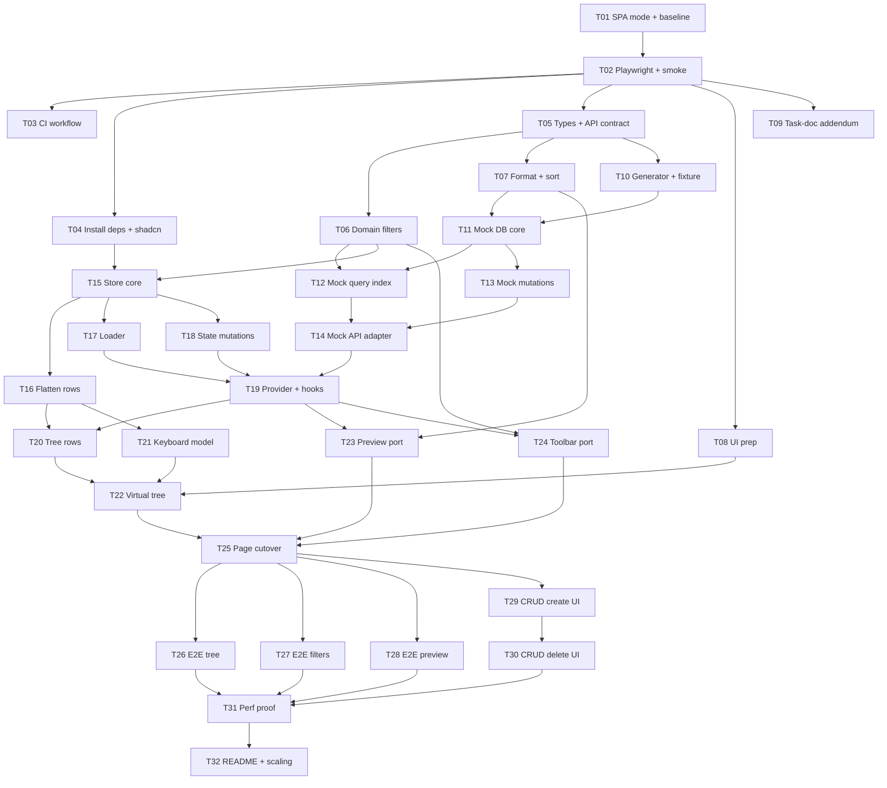

# Tasks: Scalable File Explorer refactor

> Plan and decisions: [`plan.md`](./plan.md) (the decision IDs D1–D12 are referenced below).
> Statuses: `todo` · `in-progress` · `blocked` · `review` · `done`. Update the status line in the task and in the index table in the same commit.

## Working agreement

### Branches and worktrees

- Integration branch: `refactor/lazy-explorer`, created from `main`. Tasks merge into it; it merges into `main` once all tasks are `done`.
- One worktree and one branch per task:

  ```bash
  git worktree add ../bindecy-worktrees/T06 -b task/T06-domain-filters refactor/lazy-explorer
  cd ../bindecy-worktrees/T06 && bun install
  ```

- Before merging, rebase onto `refactor/lazy-explorer`, run the gates, then merge (fast-forward or squash). Afterwards run `git worktree remove ../bindecy-worktrees/T06`.
- Tasks in the same wave touch **disjoint files** (listed under *Touch*). If a task has to edit a file outside its *Touch* list, stop and coordinate first.
- **`package.json` and `bun.lock` are changed only by T01, T02 and T04.** Any other task that needs a package must go back to T04's owner.
- **E2E ports.** Parallel worktrees must not share port 5173. T02 makes the port configurable via `E2E_PORT`; each worktree picks its own (e.g. `E2E_PORT=5200 + task number`).

### Gates, run before moving a task to `review`

```bash
bun run format:check && bun run typecheck && bun run test
```

Tasks that touch config, routes or the page also run `bun run build`. Tasks with E2E specs also run `bun run test:e2e`.

### Rules for implementers

- Read only the files listed under *Read first*, plus the files you touch. The contract types in T05 are the source of truth; don't redefine them.
- Tests: behavior, boundaries and errors. Don't test wiring, mock echoes or CSS classes (see the existing test style in `app/components/project-overview/*.test.*`).
- Don't delete old code before **T25**. Until then the old UI stays on the index route.

## Dependency graph



**Critical path:** T01 → T02 → T05 → T07 → T11 → T12 → T14 → T19 → T20 → T22 → T25 → T29 → T30 → T31 → T32.

## Waves (tasks within a wave can run in parallel worktrees)

| Wave | Tasks | Notes |
| --- | --- | --- |
| W0 | T01 | Records baseline gate results |
| W1 | T02 | |
| W2 | T03, T04, T05, T08, T09 | T04 is the only lockfile writer in this wave |
| W3 | T06, T07, T10 | |
| W4 | T11, T15 | |
| W5 | T12, T13, T16, T17, T18 | T12 and T13 connect through the mutation listener from T11 |
| W6 | T14, T21 | |
| W7 | T19 | |
| W8 | T20, T23, T24 | |
| W9 | T22 | |
| W10 | T25 | The app switches to the new feature here |
| W11 | T26, T27, T28, T29 | E2E specs are separate files; T29 owns `tree-actions.tsx` |
| W12 | T30 | |
| W13 | T31 | |
| W14 | T32 | |

## Index

| ID | Title | Phase | Depends on | Wave | Status |
| --- | --- | --- | --- | --- | --- |
| T01 | SPA mode + baseline gates | 0 | — | W0 | todo |
| T02 | Playwright setup + smoke test | 0 | T01 | W1 | todo |
| T03 | CI workflow | 0 | T02 | W2 | todo |
| T04 | Install runtime deps + shadcn CRUD components | 1 | T02 | W2 | todo |
| T05 | Domain types + API contract | 1 | T02 | W2 | todo |
| T06 | Domain filters | 1 | T05 | W3 | todo |
| T07 | Domain format + sort | 1 | T05 | W3 | todo |
| T08 | UI prep: ScrollArea `viewportRef` + category details | 1 | T02 | W2 | todo |
| T09 | Task-doc addendum | 1 | T02 | W2 | todo |
| T10 | Seeded generator + curated fixture | 2 | T05 | W3 | todo |
| T11 | Mock DB core | 2 | T07, T10 | W4 | todo |
| T12 | Mock query index | 2 | T06, T11 | W5 | todo |
| T13 | Mock mutations | 2 | T11 | W5 | todo |
| T14 | Mock API adapter + URL config | 2 | T12, T13 | W6 | todo |
| T15 | Explorer store core (incl. D3) | 3 | T04, T06 | W4 | todo |
| T16 | Visible rows (flatten) | 3 | T15 | W5 | todo |
| T17 | Loader (dedupe, abort, paging, reveal) | 3 | T15 | W5 | todo |
| T18 | State mutations (CRUD) | 3 | T15 | W5 | todo |
| T19 | Explorer provider + hooks | 3 | T14, T17, T18 | W7 | todo |
| T20 | Tree row components | 4 | T16, T19 | W8 | todo |
| T21 | Tree keyboard model | 4 | T16 | W6 | todo |
| T22 | Virtual tree | 4 | T08, T20, T21 | W9 | todo |
| T23 | Preview port (`useNodeDetail`) | 4 | T07, T19 | W8 | todo |
| T24 | Filter toolbar port (debounced) | 4 | T06, T19 | W8 | todo |
| T25 | Page cutover + delete old code | 5 | T22, T23, T24 | W10 | todo |
| T26 | E2E: tree | 5 | T25 | W11 | todo |
| T27 | E2E: filters + selection clearing | 5 | T25 | W11 | todo |
| T28 | E2E: preview | 5 | T25 | W11 | todo |
| T29 | CRUD: create UI | 5 | T25 | W11 | todo |
| T30 | CRUD: delete UI | 5 | T29 | W12 | todo |
| T31 | Performance proof | 6 | T26, T27, T28, T30 | W13 | todo |
| T32 | README + scaling write-up | 6 | T31 | W14 | todo |

---

## Phase 0: Harness

### T01: SPA mode + baseline gates

- **Status:** todo
- **Depends on:** —
- **Read first:** `react-router.config.ts`, `app/root.tsx`, `package.json`, the React Router "SPA Mode" docs (current version).
- **Touch:** `react-router.config.ts`, `app/root.tsx`, `package.json`, `bun.lock`, `tasks.md` (the baseline notes below).
- **Change:**
  1. Before editing, run `format:check`, `typecheck`, `test` and `build`, and record the results under *Baseline* below.
  2. Set `ssr: false` (D7). Add a root `HydrateFallback` if the docs require one; keep it minimal and use theme tokens.
  3. Replace the `start` script, which uses `react-router-serve` and needs a server build, with a static server for `build/client` that falls back to `index.html`. Use the command the docs recommend.
  4. Remove dependencies that SPA mode makes unused (`@react-router/serve`, and `@react-router/node` / `isbot` only if the build proves them unused).
- **Acceptance:** `bun run build` emits `build/client/index.html` and no server build. `bun run start` serves the app, and the tree, filters and preview work in a browser. All baseline gates remain green, or any failure is pre-existing and recorded.
- **Baseline:** _to be filled in by T01_

### T02: Playwright setup + smoke test

- **Status:** todo
- **Depends on:** T01
- **Read first:** `skill://setting-up-playwright`, `package.json`, `vitest.config.ts`, `.gitignore`.
- **Touch:** `package.json`, `bun.lock`, `playwright.config.ts`, `e2e/smoke.e2e.ts`, `.gitignore`.
- **Change:**
  1. `bun add -d @playwright/test`. Install the Chromium browser only (D6).
  2. Config:
     - `testDir: "e2e"` and `testMatch: "**/*.e2e.ts"`.
     - One loopback `baseURL` / `webServer.url` on `127.0.0.1:${E2E_PORT ?? 4173}`.
     - `webServer` builds, then serves `build/client` with the T01 static server on that port.
     - `reuseExistingServer: !process.env.CI`, `forbidOnly` in CI, retries 2 in CI.
     - `trace: "on-first-retry"`, `screenshot: "only-on-failure"`, HTML reporter with `open: "never"`.
  3. Scripts: `test:e2e`, `test:e2e:smoke` (`--grep @smoke`), `test:e2e:headed`, `test:e2e:ui`.
  4. Ignore `test-results/`, `playwright-report/`, `blob-report/` and `playwright/.cache/`.
  5. `smoke.e2e.ts @smoke`:
     - Collect `pageerror` events before navigating.
     - Assert the "Project overview" heading.
     - Click the "Brand system" folder, then assert `aria-expanded` flips.
     - Select `brand-guidelines.pdf`, then assert the preview heading shows the name.
     - Assert no page errors.
- **Acceptance:** `bunx playwright test --list` lists only `e2e/` specs. `bun run test` (Vitest) still collects no `.e2e.ts` files. `bun run test:e2e:smoke` passes. `E2E_PORT=5299 bun run test:e2e:smoke` also passes.

### T03: CI workflow

- **Status:** todo
- **Depends on:** T02
- **Read first:** `.github/workflows/react-doctor.yml`, `package.json` scripts, the current `oven-sh/setup-bun` and `actions/upload-artifact` docs.
- **Touch:** `.github/workflows/ci.yml`.
- **Change:**
  - Trigger on `pull_request` and `push` to `main`, with `permissions: contents: read`, `timeout-minutes: 15`, and concurrency cancel.
  - Steps: checkout → setup-bun → `bun install --frozen-lockfile` → `format:check` → `typecheck` → `test` → `build` → `bunx playwright install --with-deps chromium` → `test:e2e:smoke`.
  - Upload `playwright-report/` and `test-results/` on failure, tolerating missing files.
- **Acceptance:** the workflow file passes `actionlint` if available (otherwise it's reviewed manually), and every script it calls exists. Report the first CI run's result on a pushed branch.

---

## Phase 1: Contracts & domain

### T04: Install runtime deps + shadcn CRUD components

- **Status:** todo
- **Depends on:** T02
- **Read first:** `components.json`, `app/components/ui/` (existing components).
- **Touch:** `package.json`, `bun.lock`, the new files under `app/components/ui/`.
- **Change:**
  - `bun add zustand @tanstack/react-virtual use-debounce` (D1, D10, D11).
  - `bunx shadcn@latest add dialog alert-dialog` plus a select component (native select if the Base UI registry offers one, otherwise `select`) for the CRUD dialogs. Review the generated files: Base UI APIs, the `~` alias, semantic tokens only.
- **Acceptance:** all gates pass, and the new UI files format cleanly. No feature code is added in this task.

### T05: Domain types + API contract

- **Status:** todo
- **Depends on:** T02
- **Read first:** `plan.md` §Data-access interface, `app/types/project-node.ts`.
- **Touch:** `app/features/file-explorer/domain/types.ts`, `app/features/file-explorer/api/file-explorer-api.ts`.
- **Change:**
  - Define `FileCategory`, `FilterCategory` (`audio | image | video`), `FileSummary`, `FolderSummary`, `NodeSummary` (with `parentId`), `NodeDetail` (with `ancestors: {id, name}[]` and `previewUrl`), `FileQuery`, `Page<T>`, `SearchHit`, `ROOT_ID`/null root convention, and `ApiError` with codes (`network`, `not-found`, `conflict`, `validation`).
  - Define the `FileExplorerApi` interface exactly as in plan.md, with a JSDoc on each method describing paging and cursor semantics.
- **Acceptance:** typecheck passes. Types and interface only, no runtime logic except the `ApiError` class.

### T06: Domain filters

- **Status:** todo
- **Depends on:** T05
- **Read first:** `app/components/project-overview/file-tree-utils.ts:1-136`, `app/components/project-overview/file-tree-utils.test.ts`.
- **Touch:** `app/features/file-explorer/domain/filters.ts`, `filters.test.ts`.
- **Change:** port `parseSizeInMb` and `validateFileFilters` unchanged (the messages too), keeping `FileFilters` as strings. Add:
  - `toFileQuery(filters): FileQuery | null` — null when the filters are invalid.
  - `EMPTY_QUERY`.
  - `isQueryActive(query)`.
  - `queryKey(query)` — stable: sorted categories, normalized name, byte bounds.
  - `matchesFile(file, ancestorNames, query)`, implementing the folder-name-match semantics.
- **Acceptance:** tests cover trimming and case, inclusive bounds, open bounds, invalid values (negative, non-numeric, min > max), category OR, docs visible with no category selected, a folder-name match with and without size/category constraints, and `queryKey` stability regardless of category order.

### T07: Domain format + sort

- **Status:** todo
- **Depends on:** T05
- **Read first:** `app/components/project-overview/file-tree-utils.ts:315-325`.
- **Touch:** `app/features/file-explorer/domain/format.ts`, `sort.ts`, `format.test.ts`, `sort.test.ts`.
- **Change:** port `formatFileSize`. Add `compareNodes` (folders first, then `localeCompare` on the lowercased name, then id) and `sortKey(node)` / `compareSortKeys` for the keyset cursor.
- **Acceptance:** tests cover byte/KB/MB boundaries, folders before files, a tie broken by id, and case-insensitive order.

### T08: UI prep: ScrollArea `viewportRef` + category details

- **Status:** todo
- **Depends on:** T02
- **Read first:** `app/components/ui/scroll-area.tsx`, `app/components/project-overview/file-category-details.ts`.
- **Touch:** `app/components/ui/scroll-area.tsx`, `app/features/file-explorer/ui/file-category-details.ts`.
- **Change:**
  - Add an optional `viewportRef?: React.Ref<HTMLDivElement>` prop to `ScrollArea` and forward it to `ScrollAreaPrimitive.Viewport`.
  - Copy `file-category-details.ts` into the feature folder, typed against the T05 `FileCategory`. The old file is deleted in T25.
- **Acceptance:** gates pass, and existing usages behave as before (the current tests stay green).

### T09: Task-doc addendum

- **Status:** todo
- **Depends on:** T02
- **Read first:** `bindecy-task.md`.
- **Touch:** `bindecy-task.md`.
- **Change:** append an "Interviewer clarification (addendum)" section containing the agreed text: primary evaluation criteria are a large-scale tree of many thousands of items; a mocked data-access interface that behaves like a backend API; request only the data needed for the current view; attention to architecture, component boundaries, state management, rendering performance and scalability decisions.
- **Acceptance:** the original brief text is unchanged, and the addendum is clearly marked as a later clarification.

---

## Phase 2: Mock backend

### T10: Seeded generator + curated fixture

- **Status:** todo
- **Depends on:** T05
- **Read first:** `app/data/project-files.ts`, `domain/types.ts`.
- **Touch:** `app/features/file-explorer/api/mock/curated-fixture.ts`, `generate-tree.ts`, `generate-tree.test.ts`.
- **Change:**
  - `curated-fixture.ts` holds today's folders and files as flat records (`id`, `parentId`, `name`, `type`, file fields), with the same ids, names and verified preview URLs.
  - `generateTree({ seed, nodes })` uses mulberry32 and returns flat records that combine the curated fixture with a generated "Asset library" containing:
    - "Stock footage", a folder with ~5k children;
    - "Deep archive", a chain ~20 levels deep;
    - a mixed remainder up to the `nodes` total.

    Categories are mixed, sizes range from 0 B to 500 MB, and preview URLs are drawn from the verified pool.
- **Acceptance:** tests cover the same seed giving identical output, a different seed giving different output, the total count within ±1% of `nodes`, unique ids, valid `parentId` references, the wide folder having ≥ 5,000 children, a depth ≥ 20, and the curated ids being present.

### T11: Mock DB core

- **Status:** todo
- **Depends on:** T07, T10
- **Read first:** `domain/types.ts`, `domain/sort.ts`, `api/file-explorer-api.ts`.
- **Touch:** `app/features/file-explorer/api/mock/mock-db.ts`, `mock-db.test.ts`.
- **Change:** `createMockDb(records)` builds:
  - `Map<id, record>`, and `childIds` per folder (plus the root) sorted by `compareNodes`;
  - a precomputed `fileCount` per folder;
  - `getNode(id)`, which walks the ancestors;
  - `listChildren(folderId, { cursor, limit, includeIds? })`, which pages by keyset (binary search on the sort key) and returns `{ items, nextCursor, total }`;
  - `stats()`;
  - a mutation listener API, `onMutate(cb)` and `emitMutation(event)`, used by T12 and T13.

  The cursor is opaque, e.g. base64 JSON of the sort key.
- **Acceptance:** tests cover paging a 5k folder with limit 100 (no gaps, no duplicates, `nextCursor` null on the last page), an unknown folder giving `not-found`, correct ancestors for a deep node, `fileCount` aggregates on a small hand-built tree, and a cursor staying valid after an item is inserted before it (using a test helper that inserts via the internal API).

### T12: Mock query index

- **Status:** todo
- **Depends on:** T06, T11
- **Read first:** `domain/filters.ts`, `api/mock/mock-db.ts`, `app/components/project-overview/file-tree-utils.test.ts` (the semantics cases to port).
- **Touch:** `app/features/file-explorer/api/mock/mock-query-index.ts`, `mock-query-index.test.ts`.
- **Change:** `createQueryIndex(db)` works as follows:
  - `evaluate(query)` does one scan and returns `{ matchedFileIds, matchCountByFolder, folderNameMatches }`.
  - Results are cached in an LRU keyed by `queryKey` (5 entries) and cleared through `db.onMutate`.
  - Helpers:
    - `listChildren(folderId, query, cursor, limit)` keeps children that are matched files or folders with `matchCount > 0` (or a name match per the semantics);
    - `search(query, cursor, limit)` returns hits with `ancestorIds`, in tree order;
    - `stats(query)`.
- **Acceptance:** the semantics cases from the old `file-tree-utils.test.ts` are ported to the new API and pass. `matchCount` on the ancestors of a deep match is correct. The LRU evicts its oldest entry, and the cache clears on mutation. Paging works over filtered children.

### T13: Mock mutations

- **Status:** todo
- **Depends on:** T11
- **Read first:** `api/mock/mock-db.ts`, `domain/sort.ts`.
- **Touch:** `app/features/file-explorer/api/mock/mock-mutations.ts`, `mock-mutations.test.ts`.
- **Change:**
  - `createFolder` and `createFile` insert into the sorted `childIds` and update `fileCount` on the ancestors. A duplicate name among siblings is rejected with `ApiError('conflict')`; an empty name or negative size with `ApiError('validation')`.
  - `deleteNode` removes the subtree, updates the ancestors and returns `deletedIds`.
  - Each operation emits a mutation event.
- **Acceptance:** tests cover sorted insertion, aggregates after create and delete, subtree deletion ids, the conflict and validation errors, and one emitted event per mutation.

### T14: Mock API adapter + URL config

- **Status:** todo
- **Depends on:** T12, T13
- **Read first:** `api/file-explorer-api.ts`, `mock-db.ts`, `mock-query-index.ts`, `mock-mutations.ts` (exports only).
- **Touch:** `app/features/file-explorer/api/mock/mock-file-explorer-api.ts`, `mock-config.ts`, `mock-file-explorer-api.test.ts`.
- **Change:**
  - `createMockFileExplorerApi(config)` implements `FileExplorerApi` on top of the DB, the query index and the mutations.
  - Latency uses jitter (±50%) with a seeded RNG, and `latency: 0` resolves on a microtask.
  - An `AbortSignal` rejects with a `DOMException('AbortError')`, both before and during the delay.
  - `failRate` rejects reads with `ApiError('network')` at random (seeded). `failFirst=N` rejects the first N `listChildren` calls, then succeeds.
  - `parseMockConfig(searchParams)` reads `seed`, `nodes`, `latency`, `failRate` and `failFirst`, with defaults 1 / 10000 / 250 / 0 / 0, clamped to sane ranges.
- **Acceptance:** tests (fake timers) show an abort cancelling mid-delay, `failRate: 1` always rejecting, `failFirst: 2` failing exactly the first two `listChildren` calls (other reads unaffected), `latency: 0` resolving without timers, config defaults and clamping, and the adapter returning copies (mutating a result doesn't change the DB).

---

## Phase 3: State

### T15: Explorer store core (incl. D3)

- **Status:** todo
- **Depends on:** T04, T06
- **Read first:** `plan.md` §State management, `domain/types.ts`, `domain/filters.ts`.
- **Touch:** `app/features/file-explorer/state/explorer-store.ts`, `explorer-store.test.ts`.
- **Change:** `createExplorerStore()` (Zustand `createStore`) holds the state shape from plan.md. Actions:
  - `receivePage(queryKey, folderId, page, { append })` merges `nodesById` and updates the listing.
  - `setListingStatus` / `setListingError`.
  - `toggleExpanded(id)` writes to `expanded`, or to `filterExpanded[queryKey]` while filtering.
  - `revealFolders(queryKey, ids)`.
  - `select(id | null)` and `setActive(id | null)`.
  - `applyFilters(query | null)` sets `appliedQuery`, drops `filterExpanded` for other keys, and applies **D3**: if the selected file fails `matchesFile` over its `parentId` chain, it clears `selectedId` and sets `announcement` in the same `set`.
  - `isFiltering` / `currentQueryKey` selectors.
- **Acceptance:** tests cover toggles in browse vs filter mode, clearing filters restoring browse expansion, D3 clearing a non-matching selection and keeping a matching one (including a match via an ancestor folder name), `applyFilters(null)` keeping the selection, and `receivePage` append vs replace.

### T16: Visible rows (flatten)

- **Status:** todo
- **Depends on:** T15
- **Read first:** `state/explorer-store.ts` (state type and selectors only).
- **Touch:** `app/features/file-explorer/state/visible-rows.ts`, `visible-rows.test.ts`.
- **Change:**
  - `flattenVisibleRows(state): Row[]`, with `Row = { kind: 'node' | 'loading' | 'load-more' | 'error', key, id?, folderId, depth, posinset?, setsize? }`.
  - It walks the root listing for the current `queryKey`. An expanded folder with a listing recurses; one without a listing gets a `loading` row; an error gets an `error` row; a `nextCursor` adds a trailing `load-more` row.
  - Export `ROW_HEIGHT = { folder: 34, file: 50, status: 34 }` and `rowHeight(row, state)`.
- **Acceptance:** tests cover collapsed and expanded nesting, the status row for each state, `posinset`/`setsize` using `total`, filtered vs browse `queryKey`, and a stable key per row. The work is O(visible) (no traversal of collapsed subtrees; checked with a spy or a big collapsed fixture).

### T17: Loader (dedupe, abort, paging, reveal)

- **Status:** todo
- **Depends on:** T15
- **Read first:** `api/file-explorer-api.ts`, `state/explorer-store.ts`.
- **Touch:** `app/features/file-explorer/state/loader.ts`, `loader.test.ts`.
- **Change:** `createLoader(api, store, { pageSize = 100 })` provides:
  - `ensureChildren(folderId)`, `loadMore(folderId)` and `retry(folderId)`. In-flight requests are deduped per `(queryKey, folderId, cursor)`.
  - `applyFilters(query | null)` aborts the previous query's controller, calls `store.applyFilters`, runs `search(limit 50)` and `revealFolders` on the hits' ancestors when active, and refreshes `stats`.
  - `loadStats()`, which stores `{ total, filtered }`.

  Responses whose `queryKey` is no longer current are ignored. `AbortError` is not reported as an error.
- **Acceptance:** tests (with a fake API that records calls and resolves manually) cover two `ensureChildren` calls producing one request, a filter change aborting the previous requests with the stale result ignored, a `loadMore` cursor chain, a network error setting an error status, retry recovering, and the reveal expanding exactly the ancestors of the hits.

### T18: State mutations (CRUD)

- **Status:** todo
- **Depends on:** T15
- **Read first:** `plan.md` §State management (Mutations), `state/explorer-store.ts`, `domain/sort.ts`.
- **Touch:** `app/features/file-explorer/state/mutations.ts`, `mutations.test.ts`.
- **Change:** `createMutations(api, store)` provides:
  - `createFolder` and `createFile`. After the API call:
    - insert into the loaded parent listing at the sorted position, or bump only `total` when that position is beyond the loaded page;
    - bump the parent's `childCount`/`fileCount` and the ancestors' `fileCount`;
    - drop the filtered listings;
    - expand the parent and set the new node active (and selected for a file).
  - `deleteNode(id)`: after the API call, remove the `deletedIds` from `nodesById` and the listings, fix the counts, clear the selection, active row or expanded entries inside the subtree, and drop the filtered listings.
  - API errors are rethrown to the caller (for the dialogs to show).
- **Acceptance:** tests cover insertion order, insertion beyond the loaded page, count propagation, delete cleanup of selection and expanded state, filtered listings being dropped, and the error passing through with no state change.

### T19: Explorer provider + hooks

- **Status:** todo
- **Depends on:** T14, T17, T18
- **Read first:** exports of `mock-file-explorer-api.ts`, `mock-config.ts`, `explorer-store.ts`, `loader.ts`, `mutations.ts`.
- **Touch:** `app/features/file-explorer/state/explorer-provider.tsx`, `explorer-provider.test.tsx`, `app/test/setup.ts` (element-size mocks for the virtualizer).
- **Change:**
  - `<ExplorerProvider api?>` creates the api (defaulting to the mock built from `window.location.search`), the store, the loader and the mutations once, and triggers `ensureChildren(ROOT)` and `loadStats()` on mount.
  - Hooks: `useExplorer(selector)` (with shallow equality), `useLoader()`, `useMutations()`, `useApi()`.
  - `renderWithExplorer(ui, { api })` is a test helper using a zero-latency mock.
  - `setup.ts` mocks `offsetHeight`/`getBoundingClientRect` (and `ResizeObserver` if needed) so `@tanstack/react-virtual` renders rows in jsdom.
- **Acceptance:** a component test mounts the provider with a small seeded mock and sees the root listing loaded into the store. The existing tests stay green with the setup changes.

---

## Phase 4: UI

### T20: Tree row components

- **Status:** todo
- **Depends on:** T16, T19
- **Read first:** `app/components/project-overview/tree-node.tsx:124-260` (current row markup and styles), `state/visible-rows.ts`, `state/explorer-provider.tsx` (hooks), `ui/file-category-details.ts`.
- **Touch:** `app/features/file-explorer/ui/tree/tree-row.tsx`, `tree-row.test.tsx`.
- **Change:**
  - `TreeRow` is `memo`'d, keyed by `row.key`. Folder and file rows reuse the current visual design (icons, category badge, size line, the folder number showing `fileCount`, or `matchCount` while filtering, and the selected check icon).
  - Each row subscribes to its own `isExpanded`, `isSelected` and `isActive` via `useExplorer`.
  - Indentation is drawn as `depth` guide segments. The exact heights come from `ROW_HEIGHT`.
  - Status rows: `LoadingRow` (spinner, "Loading…"), `LoadMoreRow` ("Loading more… {loaded} of {total}", which calls `loader.loadMore` on mount), and `ErrorRow` ("Couldn't load {folder name}", or "Couldn't load project files" for the root, plus a Retry button).
  - Each row has `id="tree-row-{key}"`, `role="treeitem"` and the aria-level, posinset, setsize, expanded and selected attributes. Rows are not focusable; the container owns focus.
- **Acceptance:** component tests cover the accessible name and state for folder and file rows, selected and expanded states exposed through ARIA (not classes), the load-more row requesting the next page on mount, and Retry calling `loader.retry`.

### T21: Tree keyboard model

- **Status:** todo
- **Depends on:** T16
- **Read first:** `app/components/project-overview/tree-node.tsx:63-122`, `state/visible-rows.ts` (`Row` type).
- **Touch:** `app/features/file-explorer/ui/tree/tree-keyboard.ts`, `tree-keyboard.test.ts`.
- **Change:** `resolveTreeKey(rows, activeIndex, key, isExpanded) → { type: 'move', index } | { type: 'toggle', id } | { type: 'select', id } | { type: 'load-more' | 'retry', folderId } | { type: 'delete', id } | null`. It covers Up/Down/Home/End, Right (expand, or move to the first child), Left (collapse, or move to the parent via `parentId`), Enter/Space and Delete. A pure function.
- **Acceptance:** tests cover every key at the boundaries (first and last row), Left from a nested file to its parent, Right on an expanded folder, and Enter on a status row.

### T22: Virtual tree

- **Status:** todo
- **Depends on:** T08, T20, T21
- **Read first:** `app/components/project-overview/file-tree.tsx` (card header, empty state), `ui/tree/tree-row.tsx`, `ui/tree/tree-keyboard.ts`, `state/visible-rows.ts`, `components/ui/scroll-area.tsx`.
- **Touch:** `app/features/file-explorer/ui/tree/virtual-tree.tsx`, `tree-panel.tsx`, `virtual-tree.test.tsx`.
- **Change:**
  - `VirtualTree` memoizes `flattenVisibleRows`, then calls `useVirtualizer({ count, estimateSize: rowHeight, getItemKey: row.key, overscan: 10, getScrollElement: viewportRef })`.
  - The container has `role="tree"`, `tabIndex=0`, `aria-label` and `aria-activedescendant`. Its `onKeyDown` dispatches `resolveTreeKey` to the store and loader, then calls `scrollToIndex(i, { align: 'auto' })`.
  - Clicking a row sets it active and either toggles the folder or selects the file.
  - `TreePanel` is the card (title, file count badge from the stats, description, the no-results `Empty` state), with **no Expand all** (D9) and a header slot for T29's actions.
- **Acceptance:** component tests (with the jsdom size mocks) cover arrow navigation updating `aria-activedescendant`, Enter expanding a folder and showing a loading row followed by the children, and a 5,000-child folder rendering no more than ~60 `treeitem`s.

### T23: Preview port (`useNodeDetail`)

- **Status:** todo
- **Depends on:** T07, T19
- **Read first:** `app/components/project-overview/file-preview.tsx`, `file-preview.test.tsx`, `state/explorer-provider.tsx`.
- **Touch:** `app/features/file-explorer/ui/preview/file-preview.tsx` (plus split per-category files if it exceeds ~250 lines), `ui/preview/use-node-detail.ts`, `ui/preview/file-preview.test.tsx`.
- **Change:**
  - `useNodeDetail(selectedId)` fetches `api.getNode`, keeps a small cache by id, aborts when the id changes, and returns `{ status, detail, error }`.
  - Port the preview to take `NodeDetail`; the path comes from `ancestors`.
  - Keep all current states: empty, loading, image/audio/video/document, media error, unsafe URL, open-file link. Add a "Couldn't load file details" state with Retry.
- **Acceptance:** the ported preview tests pass against the new input, and a detail-fetch error shows a Retry that recovers.

### T24: Filter toolbar port (debounced)

- **Status:** todo
- **Depends on:** T06, T19
- **Read first:** `app/components/project-overview/filter-toolbar.tsx`, `domain/filters.ts`, `state/loader.ts` (`applyFilters`, `loadStats`).
- **Touch:** `app/features/file-explorer/ui/filter-toolbar/filter-toolbar.tsx`, `filter-toolbar.test.tsx`.
- **Change:**
  - Draft `FileFilters` live in local state and are validated on every change (the field errors show immediately after touch, as today).
  - `useDebouncedCallback(applyDraft, 250)` calls `toFileQuery` and passes the query to `loader.applyFilters` only when it's valid.
  - Enter calls `flush()`. Reset calls `cancel()` and applies the empty filters immediately.
  - The status line and live region use the stats: `Showing X of Y files`, no matches, "Fix the size filters…", and the D3 announcement from the store.
- **Acceptance:** tests (fake timers) show rapid typing producing one `applyFilters` call, an invalid range never calling it, Enter applying immediately, Reset cancelling the pending call, and the status text announcing the counts.

---

## Phase 5: Cutover & features

### T25: Page cutover + delete old code

- **Status:** todo
- **Depends on:** T22, T23, T24
- **Read first:** `app/components/project-overview/project-overview.tsx` (layout and header markup), `app/routes/home.tsx`, `e2e/smoke.e2e.ts`.
- **Touch:**
  - `app/features/file-explorer/ui/file-explorer.tsx`, `app/routes/home.tsx`, `e2e/smoke.e2e.ts`.
  - **Delete:** `app/components/project-overview/`, `app/data/project-files.ts`, `app/types/project-node.ts`.
- **Change:** `FileExplorer` renders `ExplorerProvider` with the header, the filter toolbar, and the grid holding `TreePanel` and the preview (same layout classes as today), and the route renders it. Delete the old feature code and its tests. Update the smoke test only if a selector changed; the flows stay the same.
- **Acceptance:** all gates plus `build` and `test:e2e` pass. No imports of the deleted paths remain (`rg` shows none). A manual check at 1280 px and 390 px: layout unchanged, no horizontal overflow.

### T26: E2E: tree

- **Status:** todo
- **Depends on:** T25
- **Touch:** `e2e/tree.e2e.ts`.
- **Change:** specs using `?seed=1&latency=50`:
  - expanding a folder shows "Loading…" and then the children;
  - scrolling the Stock footage folder loads more pages (checked by treeitem names), and the DOM holds no more than ~100 `treeitem`s after reaching row 1,000;
  - the keyboard flow (Down, Right, Left, Home, End);
  - `?failFirst=1` makes the root listing on mount fail, which shows an error row; Retry then loads the root folders.
- **Acceptance:** `bun run test:e2e -- tree` passes three times in a row locally (`--repeat-each=3`).

### T27: E2E: filters + selection clearing

- **Status:** todo
- **Depends on:** T25
- **Touch:** `e2e/filters.e2e.ts`.
- **Change:** specs:
  - typing a name updates the count badge and auto-reveals the matching ancestors;
  - category toggles combine;
  - an invalid range shows the field error and leaves the tree unchanged;
  - Reset restores browse expansion;
  - D3: a selected file that stops matching clears the preview and is announced, while a file that keeps matching stays selected.
- **Acceptance:** passes with `--repeat-each=3`.

### T28: E2E: preview

- **Status:** todo
- **Depends on:** T25
- **Touch:** `e2e/preview.e2e.ts`.
- **Change:** specs:
  - selecting one file of each category renders the matching element (img, audio, video, iframe) with its name, size and category;
  - a broken URL shows the fallback and the "Open file" link;
  - switching files keeps the folder expansion.

  Media requests are stubbed with `page.route` so the tests don't depend on the network.
- **Acceptance:** passes with `--repeat-each=3`.

### T29: CRUD: create UI

- **Status:** todo
- **Depends on:** T25
- **Read first:** `plan.md` §CRUD UX, `ui/tree/tree-panel.tsx`, `state/mutations.ts`, the T04 dialog and select components.
- **Touch:** `app/features/file-explorer/ui/tree/tree-actions.tsx`, `ui/crud/create-node-dialog.tsx`, `create-node-dialog.test.tsx`, `ui/tree/tree-panel.tsx` (the header slot only), `e2e/crud.e2e.ts`.
- **Change:**
  - `TreeActions` renders "New folder" and "New file" buttons that resolve the target parent from the active row.
  - `CreateNodeDialog` has the fields name, category, size (MB) and preview URL (optional, defaulting to a verified sample for the category). It validates on the client and shows API `conflict`/`validation` errors on the fields.
  - On success, focus returns to the tree with the new node active and scrolled into view.
- **Acceptance:** component tests cover the validation and the conflict error. An E2E spec creates a folder inside "Brand system" and a file inside it, and both appear in sorted position with the counts updated.

### T30: CRUD: delete UI

- **Status:** todo
- **Depends on:** T29
- **Read first:** `ui/tree/tree-actions.tsx`, `ui/tree/virtual-tree.tsx` (the Delete key dispatch), `state/mutations.ts`.
- **Touch:** `ui/tree/tree-actions.tsx`, `ui/crud/delete-node-dialog.tsx`, `delete-node-dialog.test.tsx`, `ui/tree/virtual-tree.tsx` (wire the `delete` action), `e2e/crud.e2e.ts` (add specs).
- **Change:**
  - A "Delete" button (disabled with no active row) and the Delete key both open an `AlertDialog` naming the node and its descendant file count.
  - Confirming calls `mutations.deleteNode`. Focus then moves to the next row, or the previous one. The preview clears if the selected file was in the subtree.
- **Acceptance:** component test for the dialog copy and the confirm/cancel paths. E2E: deleting a folder that contains the selected file removes the rows, clears the preview and moves focus to the neighbouring row.

---

## Phase 6: Proof & docs

### T31: Performance proof

- **Status:** todo
- **Depends on:** T26, T27, T28, T30
- **Touch:** `docs/performance.md`.
- **Change:** measure the production build at `?nodes=1000`, `10000` and `100000` (`latency=0`, Chromium via Playwright or DevTools):
  - initial `treeitem` count;
  - the count after opening Stock footage and scrolling to the end;
  - React Profiler commit durations for expanding a folder, an arrow-key press and a filter apply;
  - JS heap after load;
  - the time for the first filter apply at 100k (the query-index scan).

  Compare with the pre-refactor build at `main` (fixture only) where it's meaningful. Record the method and the numbers.
- **Acceptance:** `docs/performance.md` has a table per dataset size plus the reproduction commands. The DOM row count stays bounded (≤ ~100) at every size.

### T32: README + scaling write-up

- **Status:** todo
- **Depends on:** T31
- **Touch:** `README.md`, `plan.md` (tick the completion checklist).
- **Change:** rewrite the Implemented behavior, Project structure and Commands sections (e2e scripts, mock URL params). Add:
  - **Architecture:** the layers and the dependency direction.
  - **State management:** D1, with the reasoning.
  - **Data-access contract.**
  - **Scaling to 10k+:** lazy listings, keyset paging, virtualization, per-row subscriptions, debounce and abort, the server-side query index, plus the next steps (a real search index, ETags / conditional requests, push invalidation over websockets, a Web Worker for the client-side mock, and TanStack Pacer's async queuer for bulk operations).
  - A link to `docs/performance.md`.

  Remove the Expand all line and the "no API" wording.
- **Acceptance:** every command in the README runs as documented. The plan's checklist is ticked.
