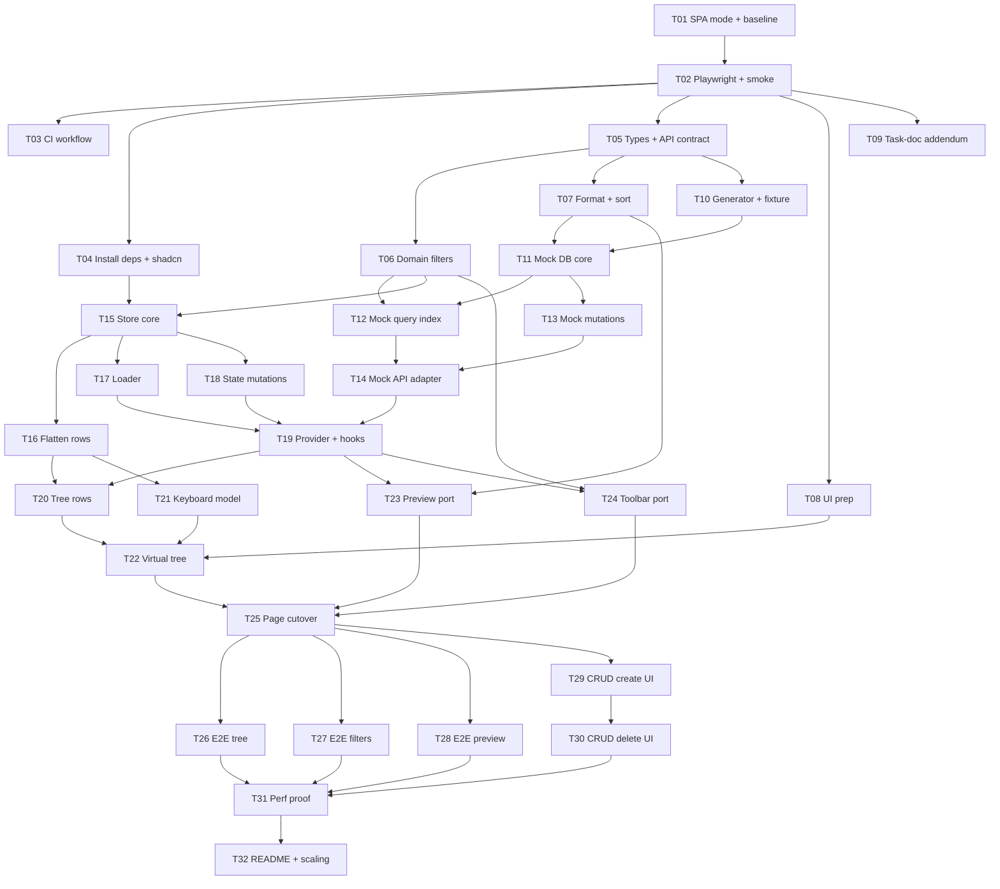

# Tasks: Scalable File Explorer refactor

> Plan and decisions: [`plan.md`](./plan.md) (the decision IDs D1–D12 are referenced below).
> Statuses: `todo` · `in-progress` · `blocked` · `review` · `done`. Update the status line in the task and in the index table in the same commit.

## Working agreement

### Branches and worktrees

- **One branch per wave**, created from an up-to-date `main` and named after the work it holds, e.g. `refactor/w4-mock-db-store` for W4 (T11 mock DB + T15 store). Each wave ships as its own PR into `main`.

  ```bash
  git checkout main && git pull --ff-only
  git checkout -b refactor/w5-query-index-loader
  ```

- **One worktree and one branch per task**, created from the wave branch:

  ```bash
  git worktree add ../bindecy-worktrees/T12 -b task/T12-query-index refactor/w5-query-index-loader
  cd ../bindecy-worktrees/T12 && bun install --frozen-lockfile
  ```

- Before merging a task, rebase it onto the wave branch, run the gates, then fast-forward the wave branch to it. Afterwards run `git worktree remove ../bindecy-worktrees/T12` and delete the task branch.
- A wave starts only after the previous wave's PR is merged into `main`.
- `refactor/lazy-explorer` was the integration branch for Phase 0 through W3 (PRs #4–#6). Don't reuse it.
- Tasks in the same wave touch **disjoint files** (listed under *Touch*). If a task has to edit a file outside its *Touch* list, stop and coordinate first.
- **`package.json` and `bun.lock` are changed only by T01, T02 and T04.** Any other task that needs a package must go back to T04's owner.
- **E2E ports.** Parallel worktrees must not share a port. T02 makes the port configurable via `E2E_PORT` (default 4173); each worktree picks its own (e.g. `E2E_PORT=5200 + task number`).

### Gates, run before moving a task to `review`

```bash
bun run format:check && bun run typecheck && bun run test
```

Tasks that touch config, routes or the page also run `bun run build`. Tasks with E2E specs or UI changes also run `bun run test:e2e`.

### Rules for implementers

- Read only the files listed under *Read first*, plus the files you touch. The contract types in T05 are the source of truth; don't redefine them.
- Tests: behavior, boundaries and errors. Don't test wiring, mock echoes or CSS classes (see the existing test style in `app/components/project-overview/*.test.*`).
- **UI changes need Playwright coverage.** A task that changes what the user sees or does (markup, clicks, keyboard, focus, loading and error states) adds or updates `e2e/*.e2e.ts` specs for that behavior in the same task and runs `bun run test:e2e`. New specs must pass with `--repeat-each=3`. Component tests stay required; they don't replace the E2E spec.
  - Until T25 the index route renders the old UI, so Playwright can't reach the new components from T20–T24. Each of those tasks has an **E2E** line naming the task (T25–T28) that must cover its flows, and that task isn't `done` until they're covered.
- Don't delete old code before **T25**. Until then the old UI stays on the index route.

## Dependency graph



**Critical path:** T01 → T02 → T05 → T07 → T11 → T12 → T14 → T19 → T20 → T22 → T25 → T29 → T30 → T31 → T32.

## Waves (tasks within a wave can run in parallel worktrees)

| Wave | Tasks | Notes |
| --- | --- | --- |
| W0 | T01 | Records baseline gate results |
| W1 | T02 | |
| W2 | T03, T04, T05, T08, T09 | T04 is the only lockfile writer in this wave |
| W3 | T06, T07, T10 | |
| W4 | T11, T15 | |
| W5 | T12, T13, T16, T17, T18 | T12 and T13 connect through the mutation listener from T11 |
| W6 | T14, T21 | |
| W7 | T19 | |
| W8 | T20, T23, T24 | |
| W9 | T22 | |
| W10 | T25 | The app switches to the new feature here |
| W11 | T26, T27, T28, T29 | E2E specs are separate files; T29 owns `tree-actions.tsx` |
| W12 | T30 | |
| W13 | T31 | |
| W14 | T32 | |

## Index

| ID | Title | Phase | Depends on | Wave | Status |
| --- | --- | --- | --- | --- | --- |
| T01 | SPA mode + baseline gates | 0 | — | W0 | done |
| T02 | Playwright setup + smoke test | 0 | T01 | W1 | done |
| T03 | CI workflow | 0 | T02 | W2 | done |
| T04 | Install runtime deps + shadcn CRUD components | 1 | T02 | W2 | done |
| T05 | Domain types + API contract | 1 | T02 | W2 | done |
| T06 | Domain filters | 1 | T05 | W3 | done |
| T07 | Domain format + sort | 1 | T05 | W3 | done |
| T08 | UI prep: ScrollArea `viewportRef` + category details | 1 | T02 | W2 | done |
| T09 | Task-doc addendum | 1 | T02 | W2 | done |
| T10 | Seeded generator + curated fixture | 2 | T05 | W3 | done |
| T11 | Mock DB core | 2 | T07, T10 | W4 | done |
| T12 | Mock query index | 2 | T06, T11 | W5 | done |
| T13 | Mock mutations | 2 | T11 | W5 | done |
| T14 | Mock API adapter + URL config | 2 | T12, T13 | W6 | done |
| T15 | Explorer store core (incl. D3) | 3 | T04, T06 | W4 | done |
| T16 | Visible rows (flatten) | 3 | T15 | W5 | done |
| T17 | Loader (dedupe, abort, paging, reveal) | 3 | T15 | W5 | done |
| T18 | State mutations (CRUD) | 3 | T15 | W5 | done |
| T19 | Explorer provider + hooks | 3 | T14, T17, T18 | W7 | done |
| T20 | Tree row components | 4 | T16, T19 | W8 | review |
| T21 | Tree keyboard model | 4 | T16 | W6 | done |
| T22 | Virtual tree | 4 | T08, T20, T21 | W9 | todo |
| T23 | Preview port (`useNodeDetail`) | 4 | T07, T19 | W8 | review |
| T24 | Filter toolbar port (debounced) | 4 | T06, T19 | W8 | review |
| T25 | Page cutover + delete old code | 5 | T22, T23, T24 | W10 | todo |
| T26 | E2E: tree | 5 | T25 | W11 | todo |
| T27 | E2E: filters + selection clearing | 5 | T25 | W11 | todo |
| T28 | E2E: preview | 5 | T25 | W11 | todo |
| T29 | CRUD: create UI | 5 | T25 | W11 | todo |
| T30 | CRUD: delete UI | 5 | T29 | W12 | todo |
| T31 | Performance proof | 6 | T26, T27, T28, T30 | W13 | todo |
| T32 | README + scaling write-up | 6 | T31 | W14 | todo |

---

## Phase 0: Harness

### T01: SPA mode + baseline gates

- **Status:** done
- **Depends on:** —
- **Read first:** `react-router.config.ts`, `app/root.tsx`, `package.json`, the React Router "SPA Mode" docs (current version).
- **Touch:** `react-router.config.ts`, `app/root.tsx`, `package.json`, `bun.lock`, `tasks.md` (the baseline notes below).
- **Change:**
  1. Before editing, run `format:check`, `typecheck`, `test` and `build`, and record the results under *Baseline* below.
  2. Set `ssr: false` (D7). Add a root `HydrateFallback` if the docs require one; keep it minimal and use theme tokens.
  3. Replace the `start` script, which uses `react-router-serve` and needs a server build, with a static server for `build/client` that falls back to `index.html`. Use the command the docs recommend.
  4. Remove dependencies that SPA mode makes unused (`@react-router/serve`, and `@react-router/node` / `isbot` only if the build proves them unused).
- **Acceptance:** `bun run build` emits `build/client/index.html` and no server build. `bun run start` serves the app, and the tree, filters and preview work in a browser. All baseline gates remain green, or any failure is pre-existing and recorded.
- **Baseline** (recorded at `d1cf1d6` before editing): `format:check` ✅, `typecheck` ✅, `test` ✅ (5 files, 34 tests), `build` ✅. The only noise is a pre-existing Vite warning: "The `envFile` option is deprecated".
- **Outcome:**
  - `ssr: false` is set. `build/` now contains only `client/` (the server build is removed after the root route is prerendered into `index.html`).
  - Added a root `HydrateFallback` ("Loading project files…", `role="status"`, theme tokens) so `index.html` doesn't paint an empty body.
  - `start` is now `vite preview --outDir build/client`. Vite is already a dependency, and it serves `index.html` for unknown paths (checked with curl on `/`, `/?nodes=1000` and `/does-not-exist`).
  - Removed `@react-router/serve`. **Kept** `@react-router/node`, which the SPA docs require for build-time root rendering, and `isbot`, which React Router's default `entry.server.node.tsx` imports at build time.
  - All gates green afterwards. Browser check on `bun run start`: folder toggle, file preview and name filter work, with no page errors.

### T02: Playwright setup + smoke test

- **Status:** done
- **Depends on:** T01
- **Read first:** `skill://setting-up-playwright`, `package.json`, `vitest.config.ts`, `.gitignore`.
- **Touch:** `package.json`, `bun.lock`, `playwright.config.ts`, `e2e/smoke.e2e.ts`, `.gitignore`.
- **Change:**
  1. `bun add -d @playwright/test`. Install the Chromium browser only (D6).
  2. Config:
     - `testDir: "e2e"` and `testMatch: "**/*.e2e.ts"`.
     - One loopback `baseURL` / `webServer.url` on `127.0.0.1:${E2E_PORT ?? 4173}`.
     - `webServer` builds, then serves `build/client` with the T01 static server on that port.
     - `reuseExistingServer: !process.env.CI`, `forbidOnly` in CI, retries 2 in CI.
     - `trace: "on-first-retry"`, `screenshot: "only-on-failure"`, HTML reporter with `open: "never"`.
  3. Scripts: `test:e2e`, `test:e2e:smoke` (`--grep @smoke`), `test:e2e:headed`, `test:e2e:ui`.
  4. Ignore `test-results/`, `playwright-report/`, `blob-report/` and `playwright/.cache/`.
  5. `smoke.e2e.ts @smoke`:
     - Collect `pageerror` events before navigating.
     - Assert the "Project overview" heading.
     - Click the "Brand system" folder, then assert `aria-expanded` flips.
     - Select `brand-guidelines.pdf`, then assert the preview heading shows the name.
     - Assert no page errors.
- **Acceptance:** `bunx playwright test --list` lists only `e2e/` specs. `bun run test` (Vitest) still collects no `.e2e.ts` files. `bun run test:e2e:smoke` passes. `E2E_PORT=5299 bun run test:e2e:smoke` also passes.
- **Outcome:**
  - `@playwright/test` 1.63.0 with Chromium.
  - `webServer` runs `bun run build && bun run start --host 127.0.0.1 --port $E2E_PORT --strictPort` (default port 4173). It tests the production SPA build, not the dev server, because Vite's first-run dependency optimization reloads the page mid-test.
  - The smoke test aborts requests to non-loopback hosts, since fixture previews point at w3.org, Unsplash and MDN, and headless Chromium blocks the PDF iframe (`ERR_BLOCKED_BY_CLIENT`). It only collects `pageerror`, not failed requests.
  - Verified: `--list` shows only `e2e/smoke.e2e.ts`; Vitest still collects 5 files / 34 tests; `test:e2e:smoke` passes on the default port and with `E2E_PORT=5299`; typecheck and format pass.

### T03: CI workflow

- **Status:** done
- **Depends on:** T02
- **Read first:** `.github/workflows/react-doctor.yml`, `package.json` scripts, the current `oven-sh/setup-bun` and `actions/upload-artifact` docs.
- **Touch:** `.github/workflows/ci.yml`.
- **Change:**
  - Trigger on `pull_request` and `push` to `main`, with `permissions: contents: read`, `timeout-minutes: 15`, and concurrency cancel.
  - Steps: checkout → setup-bun → `bun install --frozen-lockfile` → `format:check` → `typecheck` → `test` → `build` → `bunx playwright install --with-deps chromium` → `test:e2e:smoke`.
  - Upload `playwright-report/` and `test-results/` on failure, tolerating missing files.
- **Acceptance:** the workflow file passes `actionlint` if available (otherwise it's reviewed manually), and every script it calls exists. Report the first CI run's result on a pushed branch.
- **Outcome:**
  - `.github/workflows/ci.yml` pins `actions/checkout@v7`, `oven-sh/setup-bun@v2` (Bun `1.4.0`, matching the local lockfile format) and `actions/upload-artifact@v7`, the latest releases per `gh api`.
  - `actionlint` 1.7.12: no findings.
  - The full step sequence ran locally with `CI=1` (frozen install, format, typecheck, 34 unit tests, build, smoke test with `reuseExistingServer: false`): all pass.
  - First GitHub run on PR #4 (commit `085fcf4`): the `checks` job passed in 53 s ([run 36713559827](https://github.com/itays/bindecy-interview/actions/runs/36713559827/job/109880880262)). React Doctor also passed (100/100).

---

## Phase 1: Contracts & domain

### T04: Install runtime deps + shadcn CRUD components

- **Status:** done
- **Depends on:** T02
- **Read first:** `components.json`, `app/components/ui/` (existing components).
- **Touch:** `package.json`, `bun.lock`, the new files under `app/components/ui/`.
- **Change:**
  - `bun add zustand @tanstack/react-virtual use-debounce` (D1, D10, D11).
  - `bunx shadcn@latest add dialog alert-dialog` plus a select component (native select if the Base UI registry offers one, otherwise `select`) for the CRUD dialogs. Review the generated files: Base UI APIs, the `~` alias, semantic tokens only.
- **Acceptance:** all gates pass, and the new UI files format cleanly. No feature code is added in this task.
- **Outcome:**
  - Runtime deps: `zustand` 5.0.15, `@tanstack/react-virtual` 3.14.13, `use-debounce` 10.1.1. shadcn added no extra npm packages.
  - Added base-nova `dialog`, `alert-dialog` and `native-select` to `app/components/ui/`. They use `@base-ui/react`, `cn` from `cn`, `~/components/ui/button` and lucide icons, the same as the existing ui files.
  - shadcn offered to overwrite `button.tsx`; that was declined, and every existing ui file is unchanged. The CLI has no `--overwrite=false` flag, so the prompt was answered with `n`.
  - The generated dialog overlays used the raw `bg-black/10`; both now use the semantic `bg-foreground/10`. `native-select` keeps shadcn's `bg-[Canvas] text-[CanvasText]` on `<option>`: these are CSS system colors that follow the color scheme, not palette colors.
  - Gates: format, typecheck, 34 unit tests and build pass.

### T05: Domain types + API contract

- **Status:** done
- **Depends on:** T02
- **Read first:** `plan.md` §Data-access interface, `app/types/project-node.ts`.
- **Touch:** `app/features/file-explorer/domain/types.ts`, `app/features/file-explorer/api/file-explorer-api.ts`.
- **Change:**
  - Define `FileCategory`, `FilterCategory` (`audio | image | video`), `FileSummary`, `FolderSummary`, `NodeSummary` (with `parentId`), `NodeDetail` (with `ancestors: {id, name}[]` and `previewUrl`), `FileQuery`, `Page<T>`, `SearchHit`, `ROOT_ID`/null root convention, and `ApiError` with codes (`network`, `not-found`, `conflict`, `validation`).
  - Define the `FileExplorerApi` interface exactly as in plan.md, with a JSDoc on each method describing paging and cursor semantics.
- **Acceptance:** typecheck passes. Types and interface only, no runtime logic except the `ApiError` class.
- **Outcome:**
  - `domain/types.ts`: `FileCategory` keeps the fixture values (`audio | video | image | doc`); `FilterCategory = Exclude<FileCategory, "doc">`. `FileQuery = {name, minBytes, maxBytes, categories}` with the name trimmed, byte bounds inclusive and `null` meaning open-ended. `NodeDetail = FolderDetail | FileDetail`; only `FileDetail` carries `previewUrl`, and `ancestors` run from the top-level folder down to the parent. `SearchHit = FileSummary & {ancestorIds}`.
  - Root convention: the API uses `null` for the root; `ROOT_ID = "root"` is the key for the root listing in id-keyed maps (fixture ids are `folder-*`/`file-*`, so no collision).
  - `api/file-explorer-api.ts`: named request/input types (`ListChildrenRequest`, `SearchRequest`, `StatsRequest`, `CreateFolderInput`, `CreateFileInput`) with the plan's shapes; JSDoc fixes the order, cursor stability, abort (`DOMException` `"AbortError"`) and which `ApiError` code each method rejects with. `search` returns hits in tree order so the first ~50 hits reveal the top of the tree (D2).
  - `ApiError` lives in `api/` rather than `domain/`: it's part of the transport contract, and `domain/` stays error-free.
  - Gates: format, typecheck and 34 unit tests pass.

### T06: Domain filters

- **Status:** done
- **Depends on:** T05
- **Read first:** `app/components/project-overview/file-tree-utils.ts:1-136`, `app/components/project-overview/file-tree-utils.test.ts`.
- **Touch:** `app/features/file-explorer/domain/filters.ts`, `filters.test.ts`.
- **Change:** port `parseSizeInMb` and `validateFileFilters` unchanged (the messages too), keeping `FileFilters` as strings. Add:
  - `toFileQuery(filters): FileQuery | null` — null when the filters are invalid.
  - `EMPTY_QUERY`.
  - `isQueryActive(query)`.
  - `queryKey(query)` — stable: sorted categories, normalized name, byte bounds.
  - `matchesFile(file, ancestorNames, query)`, implementing the folder-name-match semantics.
- **Acceptance:** tests cover trimming and case, inclusive bounds, open bounds, invalid values (negative, non-numeric, min > max), category OR, docs visible with no category selected, a folder-name match with and without size/category constraints, and `queryKey` stability regardless of category order.
- **Outcome:**
  - `domain/filters.ts` owns `FileFilters` (the toolbar's strings) and `FileFilterValidation`. `parseSizeInMb` and `validateFileFilters` are ported unchanged, messages included. `toFileQuery` returns `null` for invalid filters, trims the name but keeps its case, and dedupes categories without mutating its input.
  - `queryKey(query)` is `JSON.stringify([trimmed lowercased name, minBytes, maxBytes, sorted unique categories])`. Name case, whitespace and category order or duplicates don't change it; `null` and `0` bounds stay distinct.
  - `isQueryActive` is true when any dimension is set, including a `minBytes: 0` bound that excludes nothing.
  - `matchesFile(file, ancestorNames, query)` checks size, then category, then the name, returning early; the name passes if the file name or any ancestor folder name contains it. Docs fail once any category is selected. `EMPTY_QUERY` is shared and must not be mutated.
  - Matching uses `toLowerCase` instead of the old `toLocaleLowerCase`, so cache keys and matches don't depend on the runtime locale.
  - Gates: format, typecheck and 100 unit tests (8 files) pass.

### T07: Domain format + sort

- **Status:** done
- **Depends on:** T05
- **Read first:** `app/components/project-overview/file-tree-utils.ts:315-325`.
- **Touch:** `app/features/file-explorer/domain/format.ts`, `sort.ts`, `format.test.ts`, `sort.test.ts`.
- **Change:** port `formatFileSize`. Add `compareNodes` (folders first, then `localeCompare` on the lowercased name, then id) and `sortKey(node)` / `compareSortKeys` for the keyset cursor.
- **Acceptance:** tests cover byte/KB/MB boundaries, folders before files, a tie broken by id, and case-insensitive order.
- **Outcome:**
  - `domain/format.ts`: `formatFileSize` ported unchanged (`B` below 1 KiB, `KB` below 1 MiB, otherwise `MB`, one fraction digit, `en` grouping). The old rounding quirk stays: 1 MiB − 1 byte formats as `1,024 KB`.
  - `domain/sort.ts`: `SortKey = readonly [rank: 0 | 1, name: string, id: string]` (folder 0, file 1, lowercased name, id). It's plain JSON, so the mock backend can encode it as a base64 cursor; validate its shape when decoding.
  - `compareNodes` is `compareSortKeys(sortKey(a), sortKey(b))`, so the listing order and the cursor order can't drift. Names compare with one module-level `Intl.Collator("en")` (a fixed locale keeps the order deterministic and is faster than `localeCompare` per call); the id tiebreak compares code units, so the order is total.
  - Hot loops (sorting 5k siblings, binary search) should precompute keys once and call `compareSortKeys` directly, instead of allocating a tuple per comparison through `compareNodes`.
  - Gates: format, typecheck and 56 unit tests (7 files) pass.

### T08: UI prep: ScrollArea `viewportRef` + category details

- **Status:** done
- **Depends on:** T02
- **Read first:** `app/components/ui/scroll-area.tsx`, `app/components/project-overview/file-category-details.ts`.
- **Touch:** `app/components/ui/scroll-area.tsx`, `app/features/file-explorer/ui/file-category-details.ts`.
- **Change:**
  - Add an optional `viewportRef?: React.Ref<HTMLDivElement>` prop to `ScrollArea` and forward it to `ScrollAreaPrimitive.Viewport`.
  - Copy `file-category-details.ts` into the feature folder, typed against the T05 `FileCategory`. The old file is deleted in T25.
- **Acceptance:** gates pass, and existing usages behave as before (the current tests stay green).
- **Outcome:**
  - `ScrollArea` takes an optional `viewportRef?: React.Ref<HTMLDivElement>`, destructured so it isn't spread onto Root, and passes it as `ref` to `ScrollAreaPrimitive.Viewport`. Nothing else changed, and existing callers pass no ref.
  - `app/features/file-explorer/ui/file-category-details.ts` is a copy of the old file that imports `FileCategory` from `domain/types`; the old file stays until T25.
  - No dedicated test: a test that only checks prop forwarding pins wiring. The virtualizer tests in T22 cover the ref through real scrolling behavior.
  - Gates: format, typecheck and 34 unit tests pass.

### T09: Task-doc addendum

- **Status:** done
- **Depends on:** T02
- **Read first:** `bindecy-task.md`.
- **Touch:** `bindecy-task.md`.
- **Change:** append an "Interviewer clarification (addendum)" section containing the agreed text: primary evaluation criteria are a large-scale tree of many thousands of items; a mocked data-access interface that behaves like a backend API; request only the data needed for the current view; attention to architecture, component boundaries, state management, rendering performance and scalability decisions.
- **Acceptance:** the original brief text is unchanged, and the addendum is clearly marked as a later clarification.
- **Outcome:**
  - Appended `## Interviewer clarification (addendum)` to `bindecy-task.md`: one sentence marks it as a later clarification that isn't part of the original brief, followed by four bullets (large tree with no full load, backend-like mocked data API, request only what the view needs, evaluation focus areas).
  - The diff only adds lines at the end of the file; the original brief is unchanged.

---

## Phase 2: Mock backend

### T10: Seeded generator + curated fixture

- **Status:** done
- **Depends on:** T05
- **Read first:** `app/data/project-files.ts`, `domain/types.ts`.
- **Touch:** `app/features/file-explorer/api/mock/curated-fixture.ts`, `generate-tree.ts`, `generate-tree.test.ts`.
- **Change:**
  - `curated-fixture.ts` holds today's folders and files as flat records (`id`, `parentId`, `name`, `type`, file fields), with the same ids, names and verified preview URLs.
  - `generateTree({ seed, nodes })` uses mulberry32 and returns flat records that combine the curated fixture with a generated "Asset library" containing:
    - "Stock footage", a folder with ~5k children;
    - "Deep archive", a chain ~20 levels deep;
    - a mixed remainder up to the `nodes` total.

    Categories are mixed, sizes range from 0 B to 500 MB, and preview URLs are drawn from the verified pool.
- **Acceptance:** tests cover the same seed giving identical output, a different seed giving different output, the total count within ±1% of `nodes`, unique ids, valid `parentId` references, the wide folder having ≥ 5,000 children, a depth ≥ 20, and the curated ids being present.
- **Outcome:**
  - `generate-tree.ts` exports the record types `MockFolderRecord`, `MockFileRecord` (with `previewUrl`) and `MockRecord`, plus `mulberry32(seed)` for T14's seeded jitter and failures. `curated-fixture.ts` exports `CURATED_RECORDS` (18 records, identical to `app/data/project-files.ts` when flattened) and `PREVIEW_URLS` per category, using only the URLs already in the old fixture.
  - `generateTree({ seed, nodes })` returns exactly `nodes` records, parents before children, curated records first (copied, so callers may mutate them). It throws `RangeError` for a non-integer seed or `nodes` below 18. Generated ids are `folder-g<n>`/`file-g<n>`; the named folders have fixed ids `folder-asset-library` (top level), `folder-stock-footage` and `folder-deep-archive`.
  - At 10k nodes: Stock footage has 5,000 files (mostly video), and the Deep archive chain `Level 03`..`Level 22` has files at depths 5, 10, 15, 20 and 22. The rest is a random tree of `Collection`/`Project`/`Batch`/`Set NNN` folders up to depth 8 with every category (577 folders and 9,423 files for seed 1). Generation takes about 5 ms at 10k and about 45 ms at 100k.
  - Sibling names are unique case-insensitively by construction: each parent's child counter is part of the name. Sizes: 1% are 0 B, the rest are uniform up to a per-category cap (video 500 MB). Extensions match the preview media.
  - When `nodes` is too small for the fixed shapes, the Stock footage folder and the remainder shrink first; below about 48 nodes the output is cut to `nodes`, still parents first.
  - Gates: format, typecheck and 124 unit tests (9 files) pass.

### T11: Mock DB core

- **Status:** done
- **Depends on:** T07, T10
- **Read first:** `domain/types.ts`, `domain/sort.ts`, `api/file-explorer-api.ts`.
- **Touch:** `app/features/file-explorer/api/mock/mock-db.ts`, `mock-db.test.ts`.
- **Change:** `createMockDb(records)` builds:
  - `Map<id, record>`, and `childIds` per folder (plus the root) sorted by `compareNodes`;
  - a precomputed `fileCount` per folder;
  - `getNode(id)`, which walks the ancestors;
  - `listChildren(folderId, { cursor, limit, includeIds? })`, which pages by keyset (binary search on the sort key) and returns `{ items, nextCursor, total }`;
  - `stats()`;
  - a mutation listener API, `onMutate(cb)` and `emitMutation(event)`, used by T12 and T13.

  The cursor is opaque, e.g. base64 JSON of the sort key.
- **Acceptance:** tests cover paging a 5k folder with limit 100 (no gaps, no duplicates, `nextCursor` null on the last page), an unknown folder giving `not-found`, correct ancestors for a deep node, `fileCount` aggregates on a small hand-built tree, and a cursor staying valid after an item is inserted before it (using a test helper that inserts via the internal API).
- **Outcome:**
  - `mock-db.ts` exports `createMockDb(records)`, a synchronous in-memory index (the async adapter is T14). It stores one precomputed `SortKey` per node and a sorted `childIds` array per folder plus one for `ROOT_ID`, sorted with `compareSortKeys` over the precomputed keys. `childCount` is `childIds.length`; `fileCounts` covers every folder, and its `ROOT_ID` entry is the total that `stats()` returns.
  - The build is O(n) plus sorting: two passes over the records, a pre-order walk from the root and a reverse pass that adds each folder's file count to its parent. Records may come in any order; a duplicate id or a missing or non-folder parent throws a plain `Error` (bad input data). Measured: about 5.5 ms at 10k nodes and 71 ms at 100k.
  - `listChildren` pages by keyset in O(log n + limit): the cursor is base64 of the UTF-8 JSON of the last item's `SortKey`, validated on decode, and the next page starts at the `upperBound` binary search, so a cursor survives inserts and deletes before it. A bad limit or cursor throws `ApiError('validation')`; an unknown folder, a file or the literal `ROOT_ID` throws `not-found`. `includeIds` (for T12) filters the children first, O(children), and pages with the same keyset. Items are new objects without `previewUrl` or `matchCount`.
  - `getNode` builds `ancestors` (top-level folder first) by walking `parentId`; file details add `previewUrl`. `onMutate`/`emitMutation` carry `MockMutationEvent` (`create` with `id`, `delete` with `deletedIds`). `db.internal` (`records`, `sortKeys`, `childIds`, `fileCounts`, `upperBound`, `toSummary`) is the documented surface for T13.
  - Gates: format, typecheck and 176 unit tests (11 files) pass; `mock-db.test.ts` has 29 tests. React Doctor on the diff reports no issues.

### T12: Mock query index

- **Status:** done
- **Depends on:** T06, T11
- **Read first:** `domain/filters.ts`, `api/mock/mock-db.ts`, `app/components/project-overview/file-tree-utils.test.ts` (the semantics cases to port).
- **Touch:** `app/features/file-explorer/api/mock/mock-query-index.ts`, `mock-query-index.test.ts`.
- **Change:** `createQueryIndex(db)` works as follows:
  - `evaluate(query)` does one scan and returns `{ matchedFileIds, matchCountByFolder, folderNameMatches }`.
  - Results are cached in an LRU keyed by `queryKey` (5 entries) and cleared through `db.onMutate`.
  - Helpers:
    - `listChildren(folderId, query, cursor, limit)` keeps children that are matched files or folders with `matchCount > 0` (or a name match per the semantics);
    - `search(query, cursor, limit)` returns hits with `ancestorIds`, in tree order;
    - `stats(query)`.
- **Acceptance:** the semantics cases from the old `file-tree-utils.test.ts` are ported to the new API and pass. `matchCount` on the ancestors of a deep match is correct. The LRU evicts its oldest entry, and the cache clears on mutation. Paging works over filtered children.
- **Outcome:**
  - `mock-query-index.ts` exports `createQueryIndex(db)`. `evaluate(query)` makes one iterative depth-first pass over the sorted `childIds`, O(n) with no ancestor walk per node. It passes the nearest name-matched ancestor down the walk, so `matchesFile` stays the only file-match rule. It returns `matchedFileIds` (an array in tree order, not a Set, because search needs positions), `matchCountByFolder` (folders with at least one match; no `ROOT_ID` entry), `folderNameMatches` and `keptIds` (the `includeIds` for `db.listChildren`). Measured: about 1 ms at 10k nodes and 16 ms at 100k.
  - The keep rule is the old `filterProjectTree` rule. A folder is kept when its own name matches, when it keeps a child, or when it sits below a name-matched folder and the query has no size or category limit. So a name-matched folder with no matching files is kept with `matchCount` 0. An inactive query keeps every node, but T14 must route an omitted or inactive query to `db.listChildren` (O(log n + limit), no `matchCount`).
  - An LRU keeps up to 5 evaluations by `queryKey`; a hit refreshes the entry. Any `db.onMutate` event clears the cache, and `dispose()` unsubscribes.
  - `listChildren(folderId, query, { cursor, limit })` pages the kept children with the `db.listChildren` keyset cursor, costs O(children) per page and throws the same errors. Folders carry `matchCount`. `search(query, { cursor, limit })` returns new `SearchHit`s in tree order; `ancestorIds` run top-level first without the file, ready for `revealFolders`. `total` counts every hit. The search cursor is base64 JSON of the last hit's path of `SortKey`s, found by binary search in pre-order, so creates and deletes between pages never skip or repeat a hit. A bad cursor or limit throws `validation`. `stats(query)` returns the matched file count.
  - Gates: format, typecheck and 279 unit tests (14 files, after the rebase onto T16 and T13) pass; `mock-query-index.test.ts` has 43 tests. React Doctor reports no issues. A throwaway test (not committed) ran T13 mutations against the index: the cache cleared, and `stats`, `search` ancestors and `matchCount` followed each create and delete.

### T13: Mock mutations

- **Status:** done
- **Depends on:** T11
- **Read first:** `api/mock/mock-db.ts`, `domain/sort.ts`.
- **Touch:** `app/features/file-explorer/api/mock/mock-mutations.ts`, `mock-mutations.test.ts`.
- **Change:**
  - `createFolder` and `createFile` insert into the sorted `childIds` and update `fileCount` on the ancestors. A duplicate name among siblings is rejected with `ApiError('conflict')`; an empty name or negative size with `ApiError('validation')`.
  - `deleteNode` removes the subtree, updates the ancestors and returns `deletedIds`.
  - Each operation emits a mutation event.
- **Acceptance:** tests cover sorted insertion, aggregates after create and delete, subtree deletion ids, the conflict and validation errors, and one emitted event per mutation.
- **Outcome:**
  - `mock-mutations.ts` exports `createMockMutations(db)`, with synchronous `createFolder`, `createFile` and `deleteNode` over `db.internal`. Each operation runs all its checks before the first write, so a thrown `ApiError` changes nothing, emits nothing and uses no id. A success emits exactly one `MockMutationEvent`, after the index is consistent.
  - Create trims the name. It throws `validation` for a blank name, a file parent, or a size that isn't a non-negative safe integer (0 is allowed). It throws `not-found` for an unknown parent or the literal `ROOT_ID` (the top level is `null`), and `conflict` when a sibling folder or file has the same lowercased name. The conflict check is one binary search per rank plus a scan of the names that collate equal. New ids are `folder-new-N` / `file-new-N`: the counters never go back, skip taken ids, never reuse a deleted id and never contain `:`.
  - Create costs O(depth + siblings): `upperBound` gives the slot and a splice inserts the id. A new folder gets an empty `childIds` entry and a `fileCounts` of 0; a new file adds 1 to every ancestor and to `ROOT_ID`. It returns `toSummary(record)` (no `previewUrl`; `getNode` has it).
  - `deleteNode` costs O(subtree + depth + siblings). An iterative DFS collects `deletedIds`: the node first, then its descendants in pre-order. The node leaves its parent at `upperBound(key) - 1`, not through `indexOf`. The subtree's file count comes off every ancestor and `ROOT_ID`, and all four index maps drop each deleted id. It throws `validation` for `ROOT_ID` and `not-found` for an unknown id. The event and the return value share one `deletedIds` array, so listeners must not change it.
  - For T14: wrap the sync calls in promises and reject with the same `ApiError`. `onMutate` listeners (the T12 cache clear) run synchronously inside the mutation. A cursor taken before a create or delete still pages over the survivors without gaps or duplicates (tested).
  - Gates: format, typecheck and 236 unit tests (13 files, after the rebase onto T16) pass; `mock-mutations.test.ts` has 37 tests. React Doctor reports no issues.

### T14: Mock API adapter + URL config

- **Status:** done
- **Depends on:** T12, T13
- **Read first:** `api/file-explorer-api.ts`, `mock-db.ts`, `mock-query-index.ts`, `mock-mutations.ts` (exports only).
- **Touch:** `app/features/file-explorer/api/mock/mock-file-explorer-api.ts`, `mock-config.ts`, `mock-file-explorer-api.test.ts`.
- **Change:**
  - `createMockFileExplorerApi(config)` implements `FileExplorerApi` on top of the DB, the query index and the mutations.
  - Latency uses jitter (±50%) with a seeded RNG, and `latency: 0` resolves on a microtask.
  - Reads run against the DB after the delay, not when the call starts. So a response reflects every mutation that finished while it was in flight; T18 relies on this for a first page that is still loading during a create.
  - An `AbortSignal` rejects with a `DOMException('AbortError')`, both before and during the delay.
  - `failRate` rejects reads with `ApiError('network')` at random (seeded). `failFirst=N` rejects the first N `listChildren` calls, then succeeds.
  - `parseMockConfig(searchParams)` reads `seed`, `nodes`, `latency`, `failRate` and `failFirst`, with defaults 1 / 10000 / 250 / 0 / 0, clamped to sane ranges.
- **Acceptance:** tests (fake timers) show an abort cancelling mid-delay, `failRate: 1` always rejecting, `failFirst: 2` failing exactly the first two `listChildren` calls (other reads unaffected), `latency: 0` resolving without timers, config defaults and clamping, and the adapter returning copies (mutating a result doesn't change the DB).
- **Outcome:**
  - `createMockFileExplorerApi(config)` merges `config` with `DEFAULT_MOCK_CONFIG` and builds the generated tree, the DB, the query index and the mutations once. An omitted or inactive query goes to `db.listChildren`/`db.stats`; an active one goes to `index.listChildren` (with `matchCount`)/`index.stats`. `search` uses the index and `getNode` uses the DB.
  - Every method, mutations included, waits `latency × (0.5 + rng())` ms from its own seeded `mulberry32` stream, and only then touches the DB. `latency: 0` resolves on a microtask with no timer.
  - An aborted signal rejects at once with `DOMException('AbortError')`; aborting during the delay clears the timer and rejects the same way. With `latency: 0` there is no delay, so an abort after the call starts doesn't reject (the loader drops such responses). Mutations take no signal.
  - Failures are decided when a read's delay ends. `failRate` rejects reads with `ApiError('network')` from a second seeded stream; mutations never fail at random. `failFirst=N` rejects the first N `listChildren` calls whose delay ends, so aborted calls don't use up its budget and other reads are unaffected.
  - No extra copies (deviation): the DB, the index and the mutations already build new objects per call, and tests show that changing a result doesn't change a later identical call. `parseMockConfig` uses one table of ranges: a missing, blank or non-numeric value falls back to the default; `seed`, `nodes` and `failFirst` are truncated; limits are `nodes` 18–200,000, `latency` 0–10,000 ms, `failRate` 0–1 and `failFirst` 0–1,000.
  - Gates: format, typecheck and 394 unit tests (17 files) pass; `mock-file-explorer-api.test.ts` has 60 tests. A throwaway change that read the DB before the delay made the in-flight-mutation test fail. React Doctor reports no issues.

---

## Phase 3: State

### T15: Explorer store core (incl. D3)

- **Status:** done
- **Depends on:** T04, T06
- **Read first:** `plan.md` §State management, `domain/types.ts`, `domain/filters.ts`.
- **Touch:** `app/features/file-explorer/state/explorer-store.ts`, `explorer-store.test.ts`.
- **Change:** `createExplorerStore()` (Zustand `createStore`) holds the state shape from plan.md. Actions:
  - `receivePage(queryKey, folderId, page, { append })` merges `nodesById` and updates the listing.
  - `setListingStatus` / `setListingError`.
  - `toggleExpanded(id)` writes to `expanded`, or to `filterExpanded[queryKey]` while filtering.
  - `revealFolders(queryKey, ids)`.
  - `select(id | null)` and `setActive(id | null)`.
  - `applyFilters(query | null)` sets `appliedQuery`, drops `filterExpanded` for other keys, and applies **D3**: if the selected file fails `matchesFile` over its `parentId` chain, it clears `selectedId` and sets `announcement` in the same `set`.
  - `isFiltering` / `currentQueryKey` selectors.
- **Acceptance:** tests cover toggles in browse vs filter mode, clearing filters restoring browse expansion, D3 clearing a non-matching selection and keeping a matching one (including a match via an ancestor folder name), `applyFilters(null)` keeping the selection, and `receivePage` append vs replace.
- **Outcome:**
  - `createExplorerStore()` is a vanilla Zustand store (`zustand/vanilla`, no React). Listings are keyed `listings[queryKey][folderKey(folderId)]`; `folderKey` maps the API's `null` to `ROOT_ID`, and browse mode uses `BROWSE_QUERY_KEY = "browse"`, which can't collide with the JSON-array output of `queryKey()`.
  - `receivePage` builds one new `nodesById` Map per page, appends or replaces ids, takes the page's `nextCursor`/`total` and resets the listing to `idle`. `Listing.error` is a user-facing `string | null`; `setListingStatus` accepts only `idle`/`loading` and clears the error, so an `error` status always has a message.
  - `applyFilters` treats an inactive query as `null`, returns the same state for an unchanged key, resets `filterExpanded` and leaves browse `expanded` alone. It also drops every filtered listing (browse listings keep their reference), because a folder's `matchCount` in `nodesById` belongs to one query. D3 runs in the same `set`: a selected file that fails `matchesFile` over its `parentId` chain is deselected and `announcement` names it.
  - `revealFolders` ignores a key that isn't the applied filtered key, so a late reveal from a superseded search can't expand folders. `select`, `setActive`, an unchanged `setListingStatus` and an already-expanded reveal return the same state, so subscribers aren't notified.
  - Gates: format, typecheck and 147 unit tests (10 files) pass; `explorer-store.test.ts` has 24 tests.

### T16: Visible rows (flatten)

- **Status:** done
- **Depends on:** T15
- **Read first:** `state/explorer-store.ts` (state type and selectors only).
- **Touch:** `app/features/file-explorer/state/visible-rows.ts`, `visible-rows.test.ts`.
- **Change:**
  - `flattenVisibleRows(state): Row[]`, with `Row = { kind: 'node' | 'loading' | 'load-more' | 'error', key, id?, folderId, depth, posinset?, setsize? }`.
  - It walks the root listing for the current `queryKey`. An expanded folder with a listing recurses; one without a listing gets a `loading` row; an error gets an `error` row; a `nextCursor` adds a trailing `load-more` row.
  - Export `ROW_HEIGHT = { folder: 34, file: 50, status: 34 }` and `rowHeight(row, state)`.
- **Acceptance:** tests cover collapsed and expanded nesting, the status row for each state, `posinset`/`setsize` using `total`, filtered vs browse `queryKey`, and a stable key per row. The work is O(visible) (no traversal of collapsed subtrees; checked with a spy or a big collapsed fixture).
- **Outcome:**
  - `flattenVisibleRows(state)` is a pure walk from the root listing of `currentQueryKey(state)`. It returns `Row = NodeRow | LoadingRow | LoadMoreRow | ErrorRow`, a union on `kind`. Every row has `key`, `folderId` (`null` = top level) and `depth` (0 = top level, so `aria-level = depth + 1`). Node rows add `id`, a 1-based `posinset` and `setsize = listing.total`.
  - Expansion comes from `expanded` in browse mode and from `filterExpanded[currentKey]` while filtering. A listing has at most one trailing status row at child depth: `loading` (no listing, or the first page is in flight), `error` (with `message`, after the loaded ids; it wins over a cursor, and retry resumes from the kept `nextCursor`), or `load-more` (with `loaded`/`total`) while `nextCursor !== null`. An idle, complete, empty listing has no row.
  - Keys: a node row uses the node id. A status row uses one slot key per listing, `status:<folderKey>`, so the key survives loading → error → retry. Node ids must never contain `:`.
  - The cost is O(visible rows): it reads only the listings of visible expanded folders, with one `nodesById.get` and at most one expanded-set lookup per node row. It never reads `matchCount`. A listed id without a `nodesById` entry throws a plain `Error`. `ROW_HEIGHT` and `rowHeight(row, state)` give node heights by type, and 34 px for status rows.
  - For later tasks: the function returns a new array on each call, so T19 memoizes it on `listings`, `expanded`, `filterExpanded`, `appliedQuery` and `nodesById`. The UI gets an error row's folder name from `nodesById.get(row.folderId)`. `LoadMoreRow` has no status, so T20/T22 call `loader.loadMore` whenever the row is in range and rely on the loader's dedupe.
  - Gates: format, typecheck and 199 unit tests (12 files) pass; `visible-rows.test.ts` has 25 tests. React Doctor reports no issues.

### T17: Loader (dedupe, abort, paging, reveal)

- **Status:** done
- **Depends on:** T15
- **Read first:** `api/file-explorer-api.ts`, `state/explorer-store.ts`.
- **Touch:** `app/features/file-explorer/state/loader.ts`, `loader.test.ts`; additively `state/explorer-store.ts`, `explorer-store.test.ts` (the `stats` field).
- **Change:** `createLoader(api, store, { pageSize = 100 })` provides:
  - `ensureChildren(folderId)`, `loadMore(folderId)` and `retry(folderId)`. In-flight requests are deduped per `(queryKey, folderId, cursor)`.
  - `applyFilters(query | null)` aborts the previous query's controller, calls `store.applyFilters`, runs `search(limit 50)` and `revealFolders` on the hits' ancestors when active, and refreshes `stats`.
  - `loadStats()`, which stores `{ total, filtered }`.

  Responses whose `queryKey` is no longer current are ignored. `AbortError` is not reported as an error.
- **Acceptance:** tests (with a fake API that records calls and resolves manually) cover two `ensureChildren` calls producing one request, a filter change aborting the previous requests with the stale result ignored, a `loadMore` cursor chain, a network error setting an error status, retry recovering, and the reveal expanding exactly the ancestors of the hits.
- **Outcome:**
  - The store gains `stats: ExplorerStats` (`{ total, filtered }`, both `null` at first) and `setStats(partial)`, which returns the same state when nothing changes. `applyFilters` resets `stats.filtered` to `null` when the key changes, so an old filtered count never shows under a new query.
  - `createLoader(api, store, { pageSize = 100 })` returns `ensureChildren`, `loadMore`, `retry`, `applyFilters`, `loadStats` and `dispose`. Every method resolves when its store update is done and never rejects. Page requests are deduped per `(queryKey, folderKey, cursor)` while in flight. `ensureChildren` also re-sends an orphaned first page (a `loading` listing with no ids and no request behind it). `retry` re-sends the failed first page, or the failed next page from the kept `nextCursor`.
  - Aborting (deviation): browse requests and the total count share one lifetime controller that only `dispose()` aborts. A filter change doesn't abort them, because browse listings survive filter changes and would otherwise stay `loading`. Each filtered key has its own controller, aborted with its in-flight entries when the key stops being applied. A response lands only if it is still the registered request for its slot, its key is still live, its folder is still in `nodesById` (not deleted while in flight), and a next page still continues the listing's cursor. So a late result from a superseded query, or from an earlier run of the same query (A→B→A), is dropped, and a deleted folder's page can't bring its nodes back. A first page lands even if a mutation dropped its listing meanwhile, so a mounted loading row can't hang.
  - Errors: an `AbortError` is never reported. An `ApiError` sets the listing error to its message, and any other failure sets `GENERIC_LOAD_ERROR`. `applyFilters` runs `search({ limit: 50 })` and `getStats({ query })` in parallel and reveals every ancestor id of the hits, deduped (O(hits × depth)). A failed search reveals nothing; a failed count keeps the last value. `loadStats()` loads the total, plus the filtered count while filtering.
  - For T19: call `loadStats()` on mount and after each create or delete (T18 doesn't change `stats`), and `dispose()` on unmount.
  - Gates: format, typecheck and 305 unit tests (15 files, after the rebase onto T16, T13 and T12) pass; `loader.test.ts` has 23 tests and `explorer-store.test.ts` has 27. React Doctor reports no issues. A follow-up commit after T18 adds the deleted-folder check and its test (`loader.test.ts`: 24 tests).

### T18: State mutations (CRUD)

- **Status:** done
- **Depends on:** T15
- **Read first:** `plan.md` §State management (Mutations), `state/explorer-store.ts`, `domain/sort.ts`.
- **Touch:** `app/features/file-explorer/state/mutations.ts`, `mutations.test.ts`.
- **Change:** `createMutations(api, store)` provides:
  - `createFolder` and `createFile`. After the API call:
    - insert into the loaded parent listing at the sorted position, or bump only `total` when that position is beyond the loaded page;
    - bump the parent's `childCount`/`fileCount` and the ancestors' `fileCount`;
    - drop the filtered listings;
    - expand the parent and set the new node active (and selected for a file).
  - `deleteNode(id)`: after the API call, remove the `deletedIds` from `nodesById` and the listings, fix the counts, clear the selection, active row or expanded entries inside the subtree, and drop the filtered listings.
  - API errors are rethrown to the caller (for the dialogs to show).
- **Acceptance:** tests cover insertion order, insertion beyond the loaded page, count propagation, delete cleanup of selection and expanded state, filtered listings being dropped, and the error passing through with no state change.
- **Outcome:**
  - `createMutations(api, store)` returns `createFolder`, `createFile` and `deleteNode`. Each command awaits the API first. A rejection reaches the caller as the same error instance, and the store state stays the same object. A success is one `store.setState(updater)` with no new store actions; only what changed gets new references.
  - Create finds the node's position in the parent's loaded browse listing by binary search (O(log n) `compareSortKeys` calls). It inserts when the position is inside the loaded prefix or the listing is complete; past the prefix with more pages pending, it only adds 1 to `total`. It skips a missing listing, a first page still in flight, and a node that a later page already listed. It adds 1 to the parent's `childCount` and, for a file, 1 to `fileCount` on the parent and every loaded ancestor (O(depth)). It expands the parent in the current mode's set and makes the node active (and selected for a file). The node's `parentId` comes from the API response.
  - Delete removes `deletedIds` from `nodesById`, removes the node from its parent's browse listing and deletes the browse listings of deleted folders. `total` drops by 1 only when the listing counted the node (listed, or past the prefix with pages pending). It subtracts 1 from the parent's `childCount` and the node's files from the parent and every ancestor, prunes `expanded` and every `filterExpanded` set, and clears `selectedId`/`activeId` inside the subtree. An unloaded node has no known parent, so only the entries keyed by `deletedIds` are cleaned. The cost is O(deleted + loaded siblings + depth) plus the usual shallow copies.
  - Create and delete both drop every filtered listing and keep `appliedQuery` and `filterExpanded`. `matchCount` is never changed.
  - For later tasks: `stats` is unchanged, so T19 calls `loader.loadStats()` after each create or delete. After a delete, `activeId` is `null` when it was inside the subtree, so the UI (T30) picks the next or previous row before the call and sets it afterwards. While filtering, a new node that doesn't match is active but not visible; the UI must allow that.
  - Gates: format, typecheck and 333 unit tests (16 files, after the rebase onto T16, T13, T12 and T17) pass; `mutations.test.ts` has 28 tests. React Doctor reports no issues.

### T19: Explorer provider + hooks

- **Status:** done
- **Depends on:** T14, T17, T18
- **Read first:** exports of `mock-file-explorer-api.ts`, `mock-config.ts`, `explorer-store.ts`, `loader.ts`, `mutations.ts`.
- **Touch:** `app/features/file-explorer/state/explorer-provider.tsx`, `explorer-provider.test.tsx`, `app/test/setup.ts` (element-size mocks for the virtualizer).
- **Change:**
  - `<ExplorerProvider api?>` creates the api (defaulting to the mock built from `window.location.search`), the store, the loader and the mutations once. It triggers `ensureChildren(ROOT)` and `loadStats()` on mount, calls `loader.loadStats()` after each successful create or delete, and calls `loader.dispose()` on unmount.
  - Hooks: `useExplorer(selector)` (with shallow equality), `useLoader()`, `useMutations()`, `useApi()`.
  - `renderWithExplorer(ui, { api })` is a test helper using a zero-latency mock.
  - `setup.ts` mocks `offsetHeight`/`getBoundingClientRect` (and `ResizeObserver` if needed) so `@tanstack/react-virtual` renders rows in jsdom.
- **Acceptance:** a component test mounts the provider with a small seeded mock and sees the root listing loaded into the store. The existing tests stay green with the setup changes.
- **Outcome:**
  - `state/explorer-provider.tsx` exports `ExplorerProvider` and the hooks. The provider creates the API (the URL-configured mock when no `api` prop is given; the prop is read once), the store, the loader and the mutations once per mount. Its mount effect calls `ensureChildren(null)` and `loadStats()`; its cleanup calls `loader.dispose()`, which aborts every request.
  - StrictMode: the loader handed out is restartable. `dispose` ends the current `createLoader` instance and the next call creates a new one on the same store, so StrictMode's mount → cleanup → mount still loads the root (the new instance re-sends the orphaned first page, T17). A test fails when the restart is removed.
  - `useMutations()` wraps T18's commands: each success calls `loader.loadStats()` without awaiting it, and a failure reaches the caller unchanged with no stats request.
  - Hooks: `useExplorer(selector)` (`useStore` + `useShallow`; select values, not `nodesById` or a set, since shallow equality walks a changed `Map`/`Set`), `useLoader()`, `useMutations()`, `useApi()`. Each throws a plain `Error` outside the provider.
  - Added (deviation): `useVisibleRows()` gives `flattenVisibleRows` memoized on `nodesById`, `listings`, `expanded`, `filterExpanded` and `appliedQuery` (the T16 note), so selection, focus and stats updates keep the same array. `useExplorerStore()` gives the store for `getState()` in event handlers, which T22 needs for `resolveTreeKey` and `rowHeight`.
  - `renderWithExplorer(ui, { api })` lives in `app/test/render-with-explorer.tsx` (deviation: kept out of the production module). It defaults to the default-seed mock with `latency: 0` and returns the render result plus `api`.
  - `setup.ts` (deviation): virtual-core 3.17 reads the scroll element's and rows' `offsetWidth`/`offsetHeight`, not `getBoundingClientRect`. The mock returns an element's inline `style` width/height, else 1024 × 768. A throwaway 5,000-row `useVirtualizer` list rendered a bounded window with the mock and failed without it. The existing `ResizeObserver` stub is enough.
  - For later tasks: T20/T22 read rows with `useVisibleRows()` and state with `useExplorerStore().getState()` inside handlers and `estimateSize`. Rows use fixed heights (D10); a row measured with `measureElement` reports its inline height in jsdom.
  - Gates: format, typecheck, 448 unit tests (19 files), build and `test:e2e:smoke` pass; `explorer-provider.test.tsx` has 15 tests. React Doctor reports no issues.

---

## Phase 4: UI

### T20: Tree row components

- **Status:** review
- **Depends on:** T16, T19
- **Read first:** `app/components/project-overview/tree-node.tsx:124-260` (current row markup and styles), `state/visible-rows.ts`, `state/explorer-provider.tsx` (hooks), `ui/file-category-details.ts`.
- **Touch:** `app/features/file-explorer/ui/tree/tree-row.tsx`, `tree-row.test.tsx`.
- **Change:**
  - `TreeRow` is `memo`'d, keyed by `row.key`. Folder and file rows reuse the current visual design (icons, category badge, size line, the folder number showing `fileCount`, or `matchCount` while filtering, and the selected check icon).
  - Each row subscribes to its own `isExpanded`, `isSelected` and `isActive` via `useExplorer`.
  - Indentation is drawn as `depth` guide segments. The exact heights come from `ROW_HEIGHT`.
  - Status rows: `LoadingRow` (spinner, "Loading…"), `LoadMoreRow` ("Loading more… {loaded} of {total}", which calls `loader.loadMore` on mount), and `ErrorRow` ("Couldn't load {folder name}", or "Couldn't load project files" for the root, plus a Retry button).
  - Each row has `id="tree-row-{key}"`, `role="treeitem"` and the aria-level, posinset, setsize, expanded and selected attributes. Rows are not focusable; the container owns focus.
- **Acceptance:** component tests cover the accessible name and state for folder and file rows, selected and expanded states exposed through ARIA (not classes), the load-more row requesting the next page on mount, and Retry calling `loader.retry`.
- **E2E:** not reachable before T25. T26 must cover folder and file rows (accessible name, `aria-expanded`, `aria-selected`), the "Loading…" row, the "Loading more… N of M" row, and the error row with Retry.
- **Outcome:**
  - `ui/tree/tree-row.tsx` exports `TreeRow`, `TreeRowProps` and `treeRowId(key)` (`tree-row-<key>`, for T22's `aria-activedescendant`). Props: `row`, plus optional `style` and `className` (positioning from the virtualizer; the row sets its own `height` from `ROW_HEIGHT` and ignores any passed `height`) and `onActivate(row)`, called on click. T22 renders `<TreeRow key={row.key} row={row} style={…} onActivate={…} />`; setting the row active and toggling or selecting stays in T22.
  - `TreeRow` is `memo`'d with a comparator that compares `row` and `style` shallowly (`flattenVisibleRows` builds new row objects on every run and the virtualizer a new `style` per render) and `className`/`onActivate` by identity, so T22 must keep `onActivate` stable. A new prop must be added to the comparator.
  - Node rows keep the old visual design (chevron, folder/open-folder icon, category icon and badge, `formatFileSize` line, check icon when selected, the `aria-selected`/`aria-expanded` backgrounds). Each row reads its node plus `isExpanded`, `isSelected`, `isActive` and `isFiltering` with one `useExplorer` selector of values, so it re-renders only when its own state changes; expansion comes from `expanded`, or `filterExpanded[currentQueryKey]` while filtering (as in T21). A node missing from `nodesById` throws, like T16 and T21. Status rows subscribe only to `isActive`.
  - Activity: a row is active when `activeId === row.key` (a node row's key is its id; a status row's is its slot key `status:<folderKey>`). The active row shows an inset `outline-ring` outline only while the tree container is `:focus-visible` (`group-data-active/tree-row:in-focus-visible:`), so the ring follows keyboard focus the way the old focused buttons did. `data-active` is set on the active `treeitem`.
  - Folder count: `fileCount`, or `matchCount` while filtering; a folder without `matchCount` under a query shows no count rather than a count from another query. The number is visual only (`aria-hidden`), and an `sr-only` suffix gives the accessible name, e.g. "Brand system (3 files)" or "Brand system (1 matching file)". File rows are named "brand-guidelines.pdf 4.6 MB Document". Explicit `{" "}` text nodes keep the words apart in the accessible name (jsdom doesn't lay out the flex children; the space isn't rendered).
  - Indentation: `depth` spans of 24 px, each drawing a `border-border` line 16 px in (the old `ml-4 border-l pl-2`). Rows have no gaps (the content keeps a 1 px margin), so the segments form continuous guides.
  - ARIA: `role="treeitem"`, `aria-level = depth + 1`, no `tabIndex`. Node rows set `aria-posinset`/`aria-setsize` (the listing's `total`). `aria-expanded` only on folders with `childCount > 0` (an empty folder is a leaf, as before and as in T21's Right key).
  - `aria-selected` only on file rows (deviation): folders and status rows can't be selected, and the APG leaves `aria-selected` off items that aren't selectable (the old tree did the same). Status rows have no `aria-posinset`/`aria-setsize` (deviation): they aren't members of the listing, and giving them `total + 1` would announce a wrong set size.
  - Status rows: `LoadingRow` (spinner, "Loading…"); `LoadMoreRow` ("Loading more… 1,100 of 5,000", `Intl.NumberFormat("en")`) calls `loader.loadMore(folderId)` in an effect keyed on `loader`, `folderId` and `loaded`, so it requests again after each page lands while the row stays in the rendered range (a row that stays mounted would otherwise stall; the loader dedupes); `ErrorRow` ("Couldn't load {folder name}", "Couldn't load project files" for the top level, the error `message` as the text's `title`) with a Retry button calling `loader.retry(folderId)`.
  - Retry is `tabIndex={-1}` and prevents the default on `mousedown`: the tree is one tab stop with `aria-activedescendant`, so a focusable button inside it would add a second one and a click would take focus away from the container. Keyboard users retry with Enter/Space on the active error row (T21's `retry` action). The click still bubbles to `onActivate`.
  - For later tasks: T22 passes a stable `onActivate` and `style` for positioning; no `measureElement` is needed (fixed heights). A click on a status row reaches `onActivate` too, so T22 decides whether it only activates or also loads/retries (the loader dedupes a double retry). T26 can target rows by `#tree-row-<key>` and by accessible name.
  - Smoke: a throwaway route (removed) rendered the rows in Chromium with the URL mock: continuous guides, selected file ring and check, loading row, the load-more row counting up to "Loading more… 900 of 5,000" while it stayed rendered, the error row, Retry recovering with `failFirst=2` on the second click, and focus staying on the tree container after clicking Retry. The active outline showed only after keyboard focus.
  - Gates: format, typecheck, 455 unit tests (20 files; `tree-row.test.tsx` has 7), build and `test:e2e` (1 passed, port 5220) pass. React Doctor (`--scope changed`): 96/100, one warning, `only-export-components` for `treeRowId` in a component file (Fast Refresh only; kept here because the Touch list has no other module for it).

### T21: Tree keyboard model

- **Status:** done
- **Depends on:** T16
- **Read first:** `app/components/project-overview/tree-node.tsx:63-122`, `state/visible-rows.ts` (`Row` type).
- **Touch:** `app/features/file-explorer/ui/tree/tree-keyboard.ts`, `tree-keyboard.test.ts`.
- **Change:** `resolveTreeKey(rows, activeIndex, key, isExpanded) → { type: 'move', index } | { type: 'toggle', id } | { type: 'select', id } | { type: 'load-more' | 'retry', folderId } | { type: 'delete', id } | null`. It covers Up/Down/Home/End, Right (expand, or move to the first child), Left (collapse, or move to the parent via `parentId`), Enter/Space and Delete. A pure function.
- **Acceptance:** tests cover every key at the boundaries (first and last row), Left from a nested file to its parent, Right on an expanded folder, and Enter on a status row.
- **E2E:** pure function; T26's keyboard flow covers it through T22's container. That flow must include Enter/Space on a folder and on a file, and Left from a nested file to its parent.
- **Outcome:**
  - `ui/tree/tree-keyboard.ts` exports `TreeKeyAction` and `resolveTreeKey(rows, activeIndex, key, state)`, a pure function that maps a `KeyboardEvent.key` to `move`, `toggle`, `select`, `load-more`, `retry` or `delete`, or `null` when there is nothing to do. The container that owns focus (T22) dispatches it.
  - Signature (deviation): it takes `ExplorerState` instead of `isExpanded`. Rows alone don't give the node type, `childCount`, or whether an expanded folder with an empty listing is expanded. It reads `nodesById` and the current mode's expanded set (`expanded`, or `filterExpanded[currentQueryKey]` while filtering). Left finds the parent through the row's `folderId`.
  - Up/Down/Home/End move without wrapping and return `null` when already there. With no active row, Down/Home go to the first row and Up/End to the last; empty rows return `null` for every key.
  - Right expands a collapsed folder with children (an empty one is ignored, as before), or moves from an expanded folder to its first row, which may be its loading row. Left collapses an expanded folder; otherwise it searches back to the parent row, stopping at the first shallower row. Top-level rows return `null`.
  - Enter/Space toggles a folder, selects a file, loads more on a load-more row and retries on an error row; a loading row does nothing. Delete acts only on node rows. Every key is O(1) except Left's parent search, and a node row missing from `nodesById` throws.
  - Gates: format, typecheck and 433 unit tests (18 files, after the rebase onto T14) pass; `tree-keyboard.test.ts` has 39 tests. React Doctor reports no issues.

### T22: Virtual tree

- **Status:** todo
- **Depends on:** T08, T20, T21
- **Read first:** `app/components/project-overview/file-tree.tsx` (card header, empty state), `ui/tree/tree-row.tsx`, `ui/tree/tree-keyboard.ts`, `state/visible-rows.ts`, `components/ui/scroll-area.tsx`.
- **Touch:** `app/features/file-explorer/ui/tree/virtual-tree.tsx`, `tree-panel.tsx`, `virtual-tree.test.tsx`.
- **Change:**
  - `VirtualTree` memoizes `flattenVisibleRows`, then calls `useVirtualizer({ count, estimateSize: rowHeight, getItemKey: row.key, overscan: 10, getScrollElement: viewportRef })`.
  - The container has `role="tree"`, `tabIndex=0`, `aria-label` and `aria-activedescendant`. Its `onKeyDown` dispatches `resolveTreeKey` to the store and loader, then calls `scrollToIndex(i, { align: 'auto' })`.
  - Clicking a row sets it active and either toggles the folder or selects the file.
  - `TreePanel` is the card (title, file count badge from the stats, description, the no-results `Empty` state), with **no Expand all** (D9) and a header slot for T29's actions.
- **Acceptance:** component tests (with the jsdom size mocks) cover arrow navigation updating `aria-activedescendant`, Enter expanding a folder and showing a loading row followed by the children, and a 5,000-child folder rendering no more than ~60 `treeitem`s.
- **E2E:** not reachable before T25. T26 must cover clicking a folder (toggle) and a file (select), `aria-activedescendant` following the arrow keys, and the bounded `treeitem` count in the 5,000-child folder.

### T23: Preview port (`useNodeDetail`)

- **Status:** review
- **Depends on:** T07, T19
- **Read first:** `app/components/project-overview/file-preview.tsx`, `file-preview.test.tsx`, `state/explorer-provider.tsx`.
- **Touch:** `app/features/file-explorer/ui/preview/file-preview.tsx` (plus split per-category files if it exceeds ~250 lines), `ui/preview/use-node-detail.ts`, `ui/preview/file-preview.test.tsx`.
- **Change:**
  - `useNodeDetail(selectedId)` fetches `api.getNode`, keeps a small cache by id, aborts when the id changes, and returns `{ status, detail, error }`.
  - Port the preview to take `NodeDetail`; the path comes from `ancestors`.
  - Keep all current states: empty, loading, image/audio/video/document, media error, unsafe URL, open-file link. Add a "Couldn't load file details" state with Retry.
- **Acceptance:** the ported preview tests pass against the new input, and a detail-fetch error shows a Retry that recovers.
- **E2E:** not reachable before T25. T28 must cover every category's preview, the media-error fallback with "Open file", and the loading state while the detail request is pending. The "Couldn't load file details" state has no mock switch that fails `getNode`, so only the component test covers it.
- **Outcome:**
  - `ui/preview/use-node-detail.ts`: `useNodeDetail(selectedId)` returns `NodeDetailState`, a union on `status` (`idle | loading | success | error`) with `detail`, `error` (an `Error`; a non-`Error` rejection is wrapped) and a stable `retry`. `idle` means no selection; a selected id without a result is `loading` from the first render, so nothing flashes. The fetch runs in an effect keyed on `(api, id, attempt)` with its own `AbortController`; a new id or an unmount aborts it. An `AbortError`, or a failure after the abort, is never reported; a success that lands after the abort (the zero-latency mock ignores late aborts) still fills the cache but doesn't touch the state. The only state writes are the async settle and a render-time reset when the id changes (React's "adjusting state when a prop changes" pattern), so re-selecting a file that failed earlier loads it again instead of showing the old error. `retry` only acts in the `error` state.
  - Cache: an LRU of `NODE_DETAIL_CACHE_SIZE = 20` successful details per API instance (a module `WeakMap` keyed by the `api` from `useApi()`, deviation: the provider isn't in the Touch list), so providers and tests never share entries. A hit shows at once with no request and refreshes recency; errors aren't cached. No invalidation after CRUD: nodes are immutable (no rename or update API), created nodes get new ids and deleted ids are never reused (T13), and a delete clears the selection (T18), so a stale entry can't be shown. Only a folder detail's counts could go stale, and the preview never renders folders.
  - `ui/preview/file-preview.tsx` exports `FilePreview` (no props: reads `selectedId` with `useExplorer` and calls `useNodeDetail`) and the presentational `FileDetailPreview({ detail: FileDetail })`, plus `GENERIC_DETAIL_ERROR`. The header path is the ancestor names plus the file name, joined with ` / ` as before. All the old copy stays (headings, "Select a file to preview", media labels, fallbacks, "Open file"). New states: "Loading file details…" (`role="status"`, badge "Loading") while `getNode` is pending, and "Couldn't load file details" (`role="alert"`, badge "Unavailable") showing the `ApiError` message or `GENERIC_DETAIL_ERROR`, with a Retry button. A folder detail renders the empty state.
  - The old 363-line file is split (deviation, as the Touch list allows): `preview-media.tsx` (the four media previews and `PreviewMedia`), `preview-fallback.tsx` (`OpenFileButton`, `LoadingPreview`, `PreviewFallback`) and `preview-url.ts` (`getHttpPreviewUrl`, kept out of the component files for Fast Refresh). Conditional classes use `cn` instead of template strings.
  - For later tasks: T25 renders `<FilePreview />` inside the provider in place of the old `FilePreview location=…`. T28 can target "Loading file details…" as the status text while `getNode` is pending (a `?latency=` URL makes it visible). The mock has no switch that fails `getNode`, so the error state stays covered by component tests only.
  - Tests: `file-preview.test.tsx` (15) ports the five old tests to `FileDetailPreview` and adds the ancestor path, the empty, loading and error states, Retry recovering, a generic message for a non-`ApiError`, aborting and ignoring the previous request on a new selection, a cache hit with no request, re-loading a file that failed before, clearing the selection, and a nested file from the real mock. `use-node-detail.test.tsx` (4) covers idle, LRU eviction at the 21st entry, abort on unmount and per-API isolation.
  - Gates: format, typecheck and 467 unit tests (21 files) pass; build and `test:e2e` (1 spec, port 5223) pass. React Doctor (`--scope changed --base main`) reports 4 `duplicate-jsx-subtree` warnings, each a match against the old `app/components/project-overview/file-preview.tsx` this task ports; they go away when T25 deletes it.

### T24: Filter toolbar port (debounced)

- **Status:** review
- **Depends on:** T06, T19
- **Read first:** `app/components/project-overview/filter-toolbar.tsx`, `domain/filters.ts`, `state/loader.ts` (`applyFilters`, `loadStats`).
- **Touch:** `app/features/file-explorer/ui/filter-toolbar/filter-toolbar.tsx`, `filter-toolbar.test.tsx`.
- **Change:**
  - Draft `FileFilters` live in local state and are validated on every change (the field errors show immediately after touch, as today).
  - `useDebouncedCallback(applyDraft, 250)` calls `toFileQuery` and passes the query to `loader.applyFilters` only when it's valid.
  - Enter calls `flush()`. Reset calls `cancel()` and applies the empty filters immediately.
  - The status line and live region use the stats: `Showing X of Y files`, no matches, "Fix the size filters…", and the D3 announcement from the store.
- **Acceptance:** tests (fake timers) show rapid typing producing one `applyFilters` call, an invalid range never calling it, Enter applying immediately, Reset cancelling the pending call, and the status text announcing the counts.
- **E2E:** not reachable before T25. T27 must cover the debounced apply after typing, Enter applying at once, Reset, the field errors for an invalid range, and the `Showing X of Y files` status line.
- **Outcome:**
  - `ui/filter-toolbar/filter-toolbar.tsx` exports `FilterToolbar`, which takes no props and reads everything through the provider hooks. The markup, labels, ids (`file-name`, `minimum-size`, `maximum-size`), toggle names ("Audio files", "Image files", "Video files"), "Reset filters" and the field-error rules are the old toolbar's. A size field's error shows once it's left or the draft is committed with Enter, and hides again while typing; an invalid range marks both fields.
  - The draft is local state and is validated on every render. `useDebouncedCallback(applyDraft, 250)` receives each new draft and calls `loader.applyFilters(query)` only when `toFileQuery` returns a query (an empty draft gives an inactive query, which the loader treats as `null`). Enter and submit call `flush()`. Reset calls `cancel()`, clears the draft and the touched fields, and calls `loader.applyFilters(null)` at once; it's enabled while the draft has input or a query is applied. `use-debounce` cancels a pending call on unmount.
  - File-type toggles apply at once (deviation): each toggle schedules the new draft and flushes it, so a click (and any pending typing) doesn't wait for the debounce. Rapid clicks can send several queries; the loader aborts the superseded ones.
  - Status texts come from `stats` and `appliedQuery`, with the old copy and `en-US` grouped numbers: `Showing all {total} files.`, `Showing {filtered} of {total} files.`, `No matching files. Showing 0 of {total} files.`, and "Fix the size filters to update the file results." while the draft is invalid. The badge shows `{shown} of {total} files`, or "Filters paused" for an invalid draft. While the counts load (a `null` total, or a `null` filtered count under a query) the line says "Counting files…" / "Counting matching files…" and the badge "Counting…", so a previous query's count never shows. The status describes the applied query, so a draft still waiting for the debounce keeps the last applied counts.
  - Live regions: the result region (`role="status"`, polite, atomic) announces the settled line. Loading counts, and an invalid draft whose errors aren't showing yet, keep its last message, so transient states aren't read out; Enter and Reset repeat the message. The D3 notice (the store's `announcement`, e.g. "project-brief.pdf doesn't match the filters and was deselected.") is a second polite region without a role (deviation: keeping `role="status"` unique for T27). A store subscription announces it whenever one update changes `appliedQuery` and clears the selection, so the same file deselected twice is announced twice.
  - For later tasks: T25 places `<FilterToolbar />` inside `ExplorerProvider` above the tree. T27 can target the copy above with `getByRole("status")` and the `p` status line. A failed filtered count keeps "Counting matching files…" until the next query or `loadStats()`, because the store resets `stats.filtered` when the key changes.
  - Tests use `vi.useFakeTimers({ shouldAdvanceTime: true })`: Testing Library's async wrapper waits on `setTimeout`, and with vitest's fake timers alone every `user` action hangs. The debounce is asserted right after typing and after `advanceTimersByTimeAsync(250)` inside `act`.
  - Gates: format, typecheck, 457 unit tests (20 files), build and `test:e2e` (1 smoke spec) pass; `filter-toolbar.test.tsx` has 9 tests (5 runs in a row passed). React Doctor (`--scope changed --base main`) reports no issues after moving the status texts into a pure `filterStatus` helper (it flagged the component's complexity before).

---

## Phase 5: Cutover & features

### T25: Page cutover + delete old code

- **Status:** todo
- **Depends on:** T22, T23, T24
- **Read first:** `app/components/project-overview/project-overview.tsx` (layout and header markup), `app/routes/home.tsx`, `e2e/smoke.e2e.ts`.
- **Touch:**
  - `app/features/file-explorer/ui/file-explorer.tsx`, `app/routes/home.tsx`, `e2e/smoke.e2e.ts`.
  - **Delete:** `app/components/project-overview/`, `app/data/project-files.ts`, `app/types/project-node.ts`.
- **Change:** `FileExplorer` renders `ExplorerProvider` with the header, the filter toolbar, and the grid holding `TreePanel` and the preview (same layout classes as today), and the route renders it. Delete the old feature code and its tests. Update the smoke test only if a selector changed; the flows stay the same.
- **Acceptance:** all gates plus `build` and `test:e2e` pass. No imports of the deleted paths remain (`rg` shows none). A manual check at 1280 px and 390 px: layout unchanged, no horizontal overflow.
- **E2E:** after the cutover, `e2e/smoke.e2e.ts` exercises the new explorer with the same flows (expand "Brand system", select `brand-guidelines.pdf`, see the preview, no page errors). It runs with the default mock config and its 250 ms latency, so it waits with web-first assertions, never fixed timeouts. The full `bun run test:e2e` passes.

### T26: E2E: tree

- **Status:** todo
- **Depends on:** T25
- **Touch:** `e2e/tree.e2e.ts`.
- **Change:** specs using `?seed=1&latency=50`:
  - expanding a folder shows "Loading…" and then the children;
  - scrolling the Stock footage folder loads more pages (checked by treeitem names), and the DOM holds no more than ~100 `treeitem`s after reaching row 1,000;
  - the keyboard flow (Down, Right, Left, Home, End);
  - `?failFirst=1` makes the root listing on mount fail, which shows an error row; Retry then loads the root folders;
  - the row states from T20 and the click and `aria-activedescendant` behavior from T22 (see their **E2E** lines).
- **Acceptance:** `bun run test:e2e -- tree` passes three times in a row locally (`--repeat-each=3`).

### T27: E2E: filters + selection clearing

- **Status:** todo
- **Depends on:** T25
- **Touch:** `e2e/filters.e2e.ts`.
- **Change:** specs:
  - typing a name updates the count badge and auto-reveals the matching ancestors;
  - category toggles combine;
  - an invalid range shows the field error and leaves the tree unchanged;
  - Reset restores browse expansion;
  - D3: a selected file that stops matching clears the preview and is announced, while a file that keeps matching stays selected;
  - Enter applies the filters without waiting for the debounce, and the status line shows `Showing X of Y files` (T24's **E2E** line).
- **Acceptance:** passes with `--repeat-each=3`.

### T28: E2E: preview

- **Status:** todo
- **Depends on:** T25
- **Touch:** `e2e/preview.e2e.ts`.
- **Change:** specs:
  - selecting one file of each category renders the matching element (img, audio, video, iframe) with its name, size and category;
  - a broken URL shows the fallback and the "Open file" link;
  - switching files keeps the folder expansion;
  - a loading state shows while the file detail loads (T23's **E2E** line).

  Media requests are stubbed with `page.route` so the tests don't depend on the network.
- **Acceptance:** passes with `--repeat-each=3`.

### T29: CRUD: create UI

- **Status:** todo
- **Depends on:** T25
- **Read first:** `plan.md` §CRUD UX, `ui/tree/tree-panel.tsx`, `state/mutations.ts`, the T04 dialog and select components.
- **Touch:** `app/features/file-explorer/ui/tree/tree-actions.tsx`, `ui/crud/create-node-dialog.tsx`, `create-node-dialog.test.tsx`, `ui/tree/tree-panel.tsx` (the header slot only), `e2e/crud.e2e.ts`.
- **Change:**
  - `TreeActions` renders "New folder" and "New file" buttons that resolve the target parent from the active row.
  - `CreateNodeDialog` has the fields name, category, size (MB) and preview URL (optional, defaulting to a verified sample for the category). It validates on the client and shows API `conflict`/`validation` errors on the fields.
  - On success, focus returns to the tree with the new node active and scrolled into view.
- **Acceptance:** component tests cover the validation and the conflict error. An E2E spec creates a folder inside "Brand system" and a file inside it, and both appear in sorted position with the counts updated.
- **E2E:** besides the create flow above, `e2e/crud.e2e.ts` covers a duplicate name showing the `conflict` error on the name field, and focus returning to the new row. Passes with `--repeat-each=3`.

### T30: CRUD: delete UI

- **Status:** todo
- **Depends on:** T29
- **Read first:** `ui/tree/tree-actions.tsx`, `ui/tree/virtual-tree.tsx` (the Delete key dispatch), `state/mutations.ts`.
- **Touch:** `ui/tree/tree-actions.tsx`, `ui/crud/delete-node-dialog.tsx`, `delete-node-dialog.test.tsx`, `ui/tree/virtual-tree.tsx` (wire the `delete` action), `e2e/crud.e2e.ts` (add specs).
- **Change:**
  - A "Delete" button (disabled with no active row) and the Delete key both open an `AlertDialog` naming the node and its descendant file count.
  - Confirming calls `mutations.deleteNode`. Focus then moves to the next row, or the previous one. The preview clears if the selected file was in the subtree.
- **Acceptance:** component test for the dialog copy and the confirm/cancel paths. E2E: deleting a folder that contains the selected file removes the rows, clears the preview and moves focus to the neighbouring row.
- **E2E:** besides the flow above, `e2e/crud.e2e.ts` covers the Delete key opening the dialog and Cancel leaving the tree unchanged. Passes with `--repeat-each=3`.

---

## Phase 6: Proof & docs

### T31: Performance proof

- **Status:** todo
- **Depends on:** T26, T27, T28, T30
- **Touch:** `docs/performance.md`.
- **Change:** measure the production build at `?nodes=1000`, `10000` and `100000` (`latency=0`, Chromium via Playwright or DevTools):
  - initial `treeitem` count;
  - the count after opening Stock footage and scrolling to the end;
  - React Profiler commit durations for expanding a folder, an arrow-key press and a filter apply;
  - JS heap after load;
  - the time for the first filter apply at 100k (the query-index scan).

  Compare with the pre-refactor build at `main` (fixture only) where it's meaningful. Record the method and the numbers.
- **Acceptance:** `docs/performance.md` has a table per dataset size plus the reproduction commands. The DOM row count stays bounded (≤ ~100) at every size.

### T32: README + scaling write-up

- **Status:** todo
- **Depends on:** T31
- **Touch:** `README.md`, `plan.md` (tick the completion checklist).
- **Change:** rewrite the Implemented behavior, Project structure and Commands sections (e2e scripts, mock URL params). Add:
  - **Architecture:** the layers and the dependency direction.
  - **State management:** D1, with the reasoning.
  - **Data-access contract.**
  - **Scaling to 10k+:** lazy listings, keyset paging, virtualization, per-row subscriptions, debounce and abort, the server-side query index, plus the next steps (a real search index, ETags / conditional requests, push invalidation over websockets, a Web Worker for the client-side mock, and TanStack Pacer's async queuer for bulk operations).
  - A link to `docs/performance.md`.

  Remove the Expand all line and the "no API" wording.
- **Acceptance:** every command in the README runs as documented. The plan's checklist is ticked.
